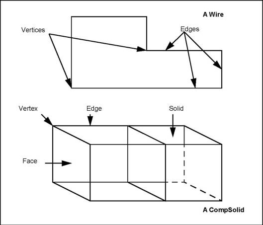
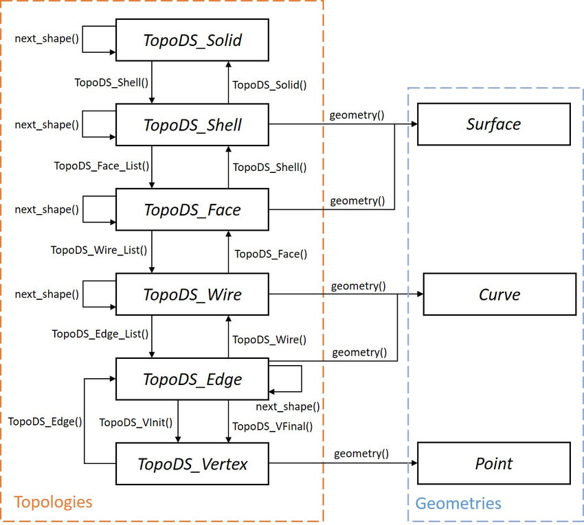

# ✅ 第1讲：什么是 BRep？

> 本讲目标：理解 BRep（边界表示）的核心概念，掌握几何与拓扑的区别，学会 PythonOCC 中的拓扑层级结构，为后续建模打下理论基础。

---

## 🧠 1. BRep 概念入门

### 📖 什么是 BRep？

**BRep（Boundary Representation，边界表示法）** 是一种三维建模的数学表示方法，通过描述物体的**边界**来定义整个三维实体。

> 💡 **核心思想**：一个三维物体可以完全由其表面（边界）来描述，就像一个气球，我们只需要知道气球皮的形状，就能知道整个气球的体积。

### 🔍 BRep vs 其他表示方法

| 表示方法 | 描述方式 | 优势 | 劣势 |
|----------|----------|------|------|
| **BRep** | 通过边界表面描述 | 精确、适合复杂形状、支持布尔运算 | 数据结构复杂 |
| **CSG** | 通过基本体的组合 | 参数化、易理解 | 难以表示自由曲面 |
| **体素** | 通过三维像素点 | 简单直观 | 精度受限、数据量大 |

---

## 🏗️ 2. 几何 与 拓扑

### 📐 几何（Geometry）
- **定义**：描述形状的**数学方程**
- **例子**：点的坐标、直线的方程、圆的半径
- **特点**：连续、无穷精度

### 🔗 拓扑（Topology）
- **定义**：描述形状的**连接关系**
- **例子**：哪些点连成边、哪些边围成面
- **特点**：离散、关系网络
- 


> **问题**：brep中为什么不可以只有几何为什么还要加拓扑，我看上去用几何就已经可以表示实体了

>**回答**：几何（Geometry） 描述的是实体的“形状”：点在哪里？这条边是圆弧还是直线？这个面是平面还是圆柱面？
> 
> 拓扑（Topology） 则描述的是“结构”：这些点和边怎么连接？这个面是封闭的吗？哪些面围成了一个体？
>
> 这里我拿一个例子来说明这个问题。
> 假设你要建一个房子模型，你有各种各样的砖块（几何）：三角形、矩形、圆形……
> 但你必须知道这些砖块怎么拼起来、哪几块围成一个房间（拓扑），房间有没有窗、门，外墙是否封闭。
> 如果你只有砖（几何），你就无法判断这个结构是不是完整的房子。


### 🧪 实例对比

```python
# 几何：定义一个圆的数学方程
from OCC.Core.gp import gp_Pnt, gp_Dir, gp_Ax2
from OCC.Core.GC import GC_MakeCircle

# 圆心在原点，半径为5的圆（几何定义）
circle_geom = GC_MakeCircle(gp_Pnt(0, 0, 0), 5.0).Value()

# 拓扑：将几何转换为可操作的边
from OCC.Core.BRepBuilderAPI import BRepBuilderAPI_MakeEdge
circle_edge = BRepBuilderAPI_MakeEdge(circle_geom).Edge()  # 拓扑边
```

---

## 🏛️ 3. BRep 的层级结构

OpenCASCADE 中的 BRep 采用**分层次结构**，从简单到复杂：

```
Vertex (顶点) → Edge (边) → Wire (线框) → Face (面) → Shell (壳) → Solid (实体)
```

### 📊 层级详解

| 层级 | 英文 | 中文 | 描述 | 示例 |
|------|------|------|------|------|
| 0维 | **Vertex** | 顶点 | 空间中的一个点 | 立方体的8个角点 |
| 1维 | **Edge** | 边 | 连接两个顶点的曲线 | 立方体的12条边 |
| 1维+ | **Wire** | 线框 | 连续的边组合 | 立方体一个面的4条边 |
| 2维 | **Face** | 面 | 由边界围成的曲面 | 立方体的6个面 |
| 2维+ | **Shell** | 壳 | 连续的面组合 | 立方体的外表面 |
| 3维 | **Solid** | 实体 | 封闭的壳形成的体积 | 完整的立方体 |


---
OCC官方的层级结构如下:



## 💻 4. PythonOCC 中的拓扑实践

### 🎯 代码示例：从零构建一个三角形面

```python
from OCC.Core.gp import gp_Pnt
from OCC.Core.BRepBuilderAPI import (
    BRepBuilderAPI_MakeVertex, 
    BRepBuilderAPI_MakeEdge, 
    BRepBuilderAPI_MakeWire, 
    BRepBuilderAPI_MakeFace
)
from OCC.Display.WebGl.jupyter_renderer import JupyterRenderer

# 1. 创建三个顶点 (Vertex)
p1 = gp_Pnt(0, 0, 0)
p2 = gp_Pnt(10, 0, 0)
p3 = gp_Pnt(5, 10, 0)

vertex1 = BRepBuilderAPI_MakeVertex(p1).Vertex()
vertex2 = BRepBuilderAPI_MakeVertex(p2).Vertex()
vertex3 = BRepBuilderAPI_MakeVertex(p3).Vertex()

# 2. 创建三条边 (Edge)
edge1 = BRepBuilderAPI_MakeEdge(vertex1, vertex2).Edge()
edge2 = BRepBuilderAPI_MakeEdge(vertex2, vertex3).Edge()
edge3 = BRepBuilderAPI_MakeEdge(vertex3, vertex1).Edge()

# 3. 创建线框 (Wire)
wire_maker = BRepBuilderAPI_MakeWire()
wire_maker.Add(edge1)
wire_maker.Add(edge2)
wire_maker.Add(edge3)
triangle_wire = wire_maker.Wire()

# 4. 创建面 (Face)
triangle_face = BRepBuilderAPI_MakeFace(triangle_wire).Face()

# 5. 可视化
renderer = JupyterRenderer()
renderer.DisplayShape(triangle_face, shape_color="#009999")
renderer.Display()
```

### 🔧 代码示例：分析现有形状的拓扑结构

```python
from OCC.Core.BRepPrimAPI import BRepPrimAPI_MakeBox
from OCC.Core.TopExp import TopExp_Explorer
from OCC.Core.TopAbs import TopAbs_VERTEX, TopAbs_EDGE, TopAbs_FACE

# 创建一个立方体
box = BRepPrimAPI_MakeBox(10, 20, 30).Shape()

# 遍历并统计各层级元素
def analyze_shape(shape):
    """分析形状的拓扑结构"""
    
    # 统计顶点
    vertex_explorer = TopExp_Explorer(shape, TopAbs_VERTEX)
    vertex_count = 0
    while vertex_explorer.More():
        vertex_count += 1
        vertex_explorer.Next()
    
    # 统计边
    edge_explorer = TopExp_Explorer(shape, TopAbs_EDGE)
    edge_count = 0
    while edge_explorer.More():
        edge_count += 1
        edge_explorer.Next()
    
    # 统计面
    face_explorer = TopExp_Explorer(shape, TopAbs_FACE)
    face_count = 0
    while face_explorer.More():
        face_count += 1
        face_explorer.Next()
    
    print(f"📊 拓扑分析结果:")
    print(f"   顶点 (Vertex): {vertex_count} 个")
    print(f"   边   (Edge):   {edge_count} 个") 
    print(f"   面   (Face):   {face_count} 个")
    
    return vertex_count, edge_count, face_count

# 分析立方体
analyze_shape(box)

# 可视化
renderer = JupyterRenderer()
renderer.DisplayShape(box, render_edges=True)
renderer.Display()
```

---

## 🎨 5. 拓扑与几何的关系实例

### 🔄 同一拓扑，不同几何

```python
from OCC.Core.GC import GC_MakeArcOfCircle, GC_MakeSegment
from OCC.Core.gp import gp_Pnt, gp_Vec

# 三个点
p1 = gp_Pnt(0, 0, 0)
p2 = gp_Pnt(10, 5, 0)
p3 = gp_Pnt(20, 0, 0)

# 方案1：直线边
straight_edge = BRepBuilderAPI_MakeEdge(
    GC_MakeSegment(p1, p2).Value()
).Edge()

# 方案2：圆弧边  
arc_edge = BRepBuilderAPI_MakeEdge(
    GC_MakeArcOfCircle(p1, p2, p3).Value()
).Edge()

print("🔄 相同的拓扑关系（连接p1和p2），不同的几何形状（直线 vs 圆弧）")

# 可视化对比
renderer = JupyterRenderer()
renderer.DisplayShape(straight_edge, shape_color="#009999")
renderer.DisplayShape(arc_edge, shape_color="#009999")
renderer.Display()
```

---

## ⚙️ 6. 常用拓扑操作工具

### 🧰 PythonOCC 拓扑相关模块

| 模块 | 功能 | 常用类 |
|------|------|--------|
| `OCC.Core.TopoDS` | 拓扑数据结构 | `TopoDS_Shape`, `TopoDS_Face` |
| `OCC.Core.TopExp` | 拓扑遍历 | `TopExp_Explorer` |
| `OCC.Core.TopTools` | 拓扑工具集 | `TopTools_ListOfShape` |
| `OCC.Core.BRepBuilderAPI` | 拓扑构建器 | `BRepBuilderAPI_Make*` 系列 |

### 🔍 实用拓扑查询函数

```python
def get_shape_info(shape):
    """获取形状的基本信息"""
    from OCC.Core.GProp import GProp_GProps
    from OCC.Core.BRepGProp import brepgprop_VolumeProperties, brepgprop_SurfaceProperties
    
    # 计算体积属性
    props = GProp_GProps()
    brepgprop_VolumeProperties(shape, props)
    volume = props.Mass()
    
    # 计算表面积
    surf_props = GProp_GProps()
    brepgprop_SurfaceProperties(shape, surf_props)
    surface_area = surf_props.Mass()
    
    print(f"📏 几何属性:")
    print(f"   体积: {volume:.2f}")
    print(f"   表面积: {surface_area:.2f}")
    
    return volume, surface_area

# 测试
box = BRepPrimAPI_MakeBox(10, 10, 10).Shape()
get_shape_info(box)
```

---

## 🧰 7. 常见问题排查

| 问题 | 可能原因 | 解决建议 |
|------|----------|----------|
| `Wire` 构建失败 | 边的连接不连续 | 检查边的端点是否正确连接 |
| `Face` 无法生成 | 线框不封闭或自相交 | 验证 Wire 的有效性 |
| 拓扑遍历无结果 | 使用错误的拓扑类型 | 确认 `TopAbs_*` 枚举类型正确 |
| 几何计算错误 | 精度问题 | 使用 `Precision::Confusion()` 设置容差 |

---

## 📘 拓展阅读

- **BRep 理论**：[OpenCASCADE BRep 格式说明](https://dev.opencascade.org/doc/occt-6.7.0/overview/html/tutorial.html)
- **拓扑算法**：[Topology Algorithms in OCCT](https://dev.opencascade.org/doc/occt-6.7.0/overview/html/occt_brep_format.html)

---


## 🌳CSG 和 Brep
###  什么是 CSG（Constructive Solid Geometry）

**CSG（构造实体几何）** 是一种用“几何积木 + 运算”来构建模型的方法：

- 使用简单的几何体（如立方体、球、圆柱等）作为基本构建单元；
- 通过 **布尔运算**（并 ∪、交 ∩、差 −）将这些几何体组合起来；
- 通常用一棵“构造树”来表示组合过程（节点是运算，叶子是几何体）；
- 适合快速构造规则结构、程序化建模等。


### CSG 与 B‑Rep（Boundary Representation）对比

| 特性                  | CSG                                                | B‑Rep（边界表示）                                      |
|-----------------------|-----------------------------------------------------|---------------------------------------------------------|
| **建模方式**          | 几何体 + 布尔运算，构造树结构                     | 用面、边、顶点构建边界网壳结构                         |
| **表达能力**          | 适合规则体组合，不擅长复杂曲面或特征              | 能表达任意复杂几何，支持倒角、圆角、壳体等             |
| **数据结构**          | 简单，数据量小                                     | 结构复杂，需维护几何+拓扑信息                          |
| **模型封闭性**        | 天然封闭，组合后一定是合法实体                    | 可能出现裂缝、重复边等问题，需要额外校验               |
| **建模效率**          | 快速，逻辑清晰，适合程序生成                      | 较慢，需要精细建模与验证                               |
| **点分类与渲染**      | 易于判断点是否在物体内部，适合光线追踪            | 渲染前需三角化，点分类依赖拓扑和射线分析               |
| **适用场景**          | 游戏建模、布尔逻辑模型、快速原型等                | CAD 设计、制造建模、曲面建模、工程分析等               |


### ✅ 使用场景

- ✅ **使用 CSG**：
  - 当你需要快速构建简单模型，或用程序自动生成几何体时；
  - 当模型主要由规则形体组成，几何细节要求不高时；

- ✅ **使用 B‑Rep**：
  - 当你要表达复杂几何曲面、倒角、挖孔等精细结构时；
  - 当模型将用于制造、CAD 分析、CAM 加工等工程应用时。

- ✅ **混合使用**：
  - 常见流程是：先用 CSG 快速建模，后转为 B‑Rep 进行细化、加工和导出。


### 🧠 总结一句话

> **CSG** 就像在搭积木，简单快速；  
> **B‑Rep** 更像雕刻雕塑，细致精密。


## 🧪 课后作业

### 📝 基础作业

1. **🔧 理论理解**
   - 用自己的话解释什么是 BRep，并举一个生活中的例子
   - 说明几何和拓扑的区别，各自的作用是什么

2. **💻 编程练习**
   - 运行本讲中的三角形构建代码，成功显示结果
   - 修改三角形的三个顶点坐标，观察形状变化

3. **🔍 拓扑分析**
   - 使用 `analyze_shape()` 函数分析圆柱体的拓扑结构
   - 预测：圆柱体应该有多少个顶点、边、面？然后验证你的预测

### 🚀 进阶作业

4. **🏗️ 自由建模**
   - 尝试构建一个四边形面（矩形或任意四边形）
   - 构建一个五边形面，并分析其拓扑结构

5. **📊 对比实验**
   - 创建相同拓扑但不同几何的两条边（如：直线边 vs 圆弧边）
   - 在可视化中用不同颜色显示，观察区别

### 💡 思考题

6. **🤔 概念思考**
   - 为什么 OpenCASCADE 要将几何和拓扑分离？这样设计有什么好处？
   - 在实际的 CAD 软件中，BRep 结构如何支持"倒角"、"圆角"等操作？如果是你俩的话会如何实现这些功能？

---

## 📋 下节预告

**第2讲：Python 建模实战** 将学习：
- 复杂形状的布尔运算（并集、交集、差集）
- 扫掠、旋转等特征建模
- 实际项目：建模一个简单的机械零件