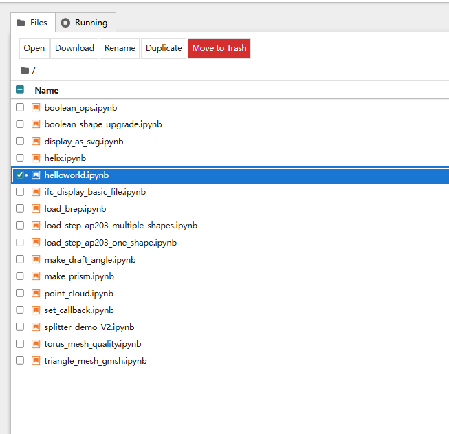
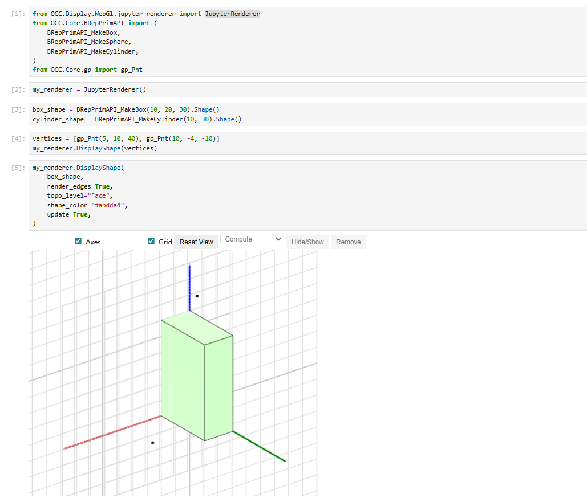
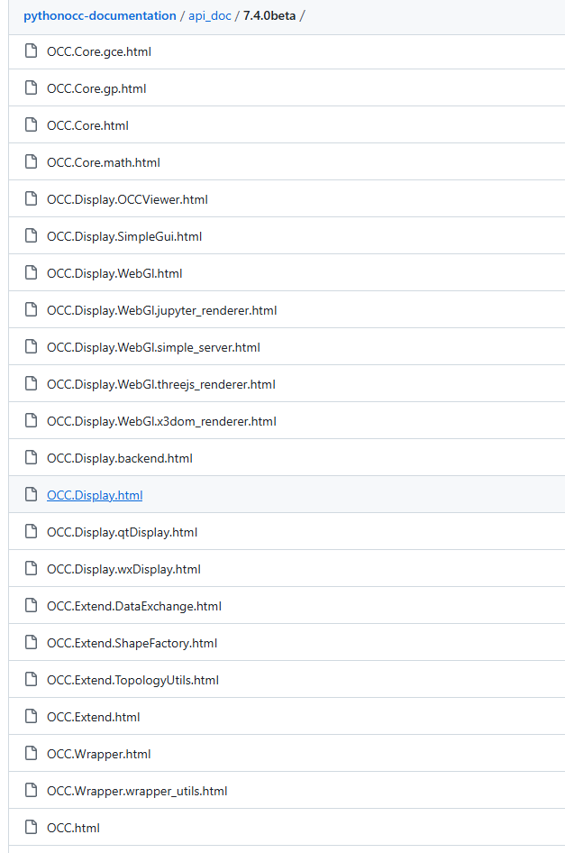
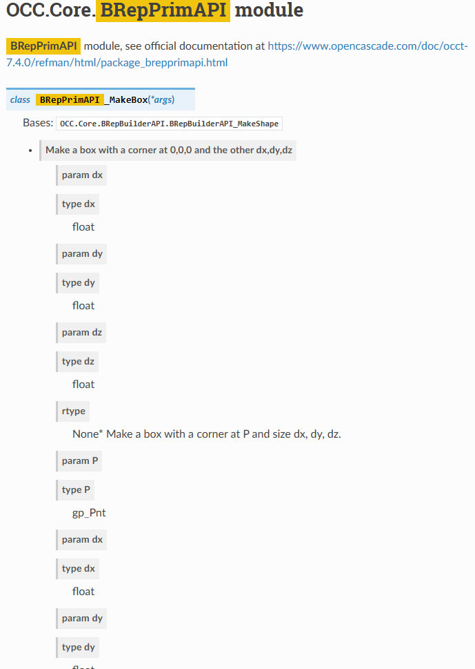

# ✅ 第0讲：环境搭建与测试

> 本讲目标：完成 PythonOCC 的环境搭建与配置，测试基本的 3D Box 输出功能，为后续建模打下基础。

---

## 🧱 1. 安装 Anaconda 与创建环境

> 推荐使用 Anaconda 管理 Python 环境，便于依赖管理与项目隔离。

### 📥 安装 Anaconda

请访问官网下载安装：

- 官网：https://www.anaconda.com/


---

## 📦 2. 安装 PythonOCC 与 Jupyter Notebook
PythonOCC 的github仓库为:https://github.com/tpaviot/pythonocc-core
> 使用 conda-forge 安装 PythonOCC 及 Jupyter，推荐版本为 `python=3.10`

```bash
# first create an environment
conda create --name=pyoccenv python=3.10
conda activate pyoccenv
conda install -c conda-forge pythonocc-core=7.9.0
```

---

## 🚀 3. 下载并测试示例代码

PythonOCC的示例代码仓库为:https://github.com/tpaviot/pythonocc-demos


这里我们为了方便测试，这里我们先关注其中jupyter_notebooks文件夹内的示例。首先将其下载解压，并在其根目录下打开cmd，并启动conda对应的环境，并打开jupyter。

```bash
conda activate pyoccenv
jupyter notebook
```
然后找到helloworld.ipynb打开运行。



> 这里会遇到ModuleNotFoundError: No module named 'jupyter_renderer'，因此需要安装jupyter_renderer
最终helloworld.ipynb的运行结果如下：



---

该文档是 Python 封装的 OCCT 函数和类的接口说明，帮助我们理解如何使用 Python 调用 OpenCASCADE 提供的功能。

---

### 📘 文档内容说明
PythonOCC api文档地址：https://github.com/tpaviot/pythonocc-documentation
这里是提供了构建好的html文档，这里我们可以先选择一个版本的文档然后打开OCC.html这个是其文档的首页



PythonOCC 是对 OpenCASCADE C++ 内核的 Python 封装，模块数量庞大，如果是在实际使用的时候是按照需要的功能来查询对应的名词来寻找的，这里简单对其中比较常见功能-名词对应关系如下：

#### ✅ 1. 基础几何与拓扑结构（几何建模核心）

| 模块 | 说明 |
|------|------|
| `OCC.Core.gp` | 基本几何构件，如点 `gp_Pnt`、方向 `gp_Dir`、坐标系 `gp_Ax2` 等 |
| `OCC.Core.TopoDS` | 拓扑结构，如点/边/面/复合体等 |
| `OCC.Core.TopExp`, `TopTools`, `TopLoc` | 拓扑遍历与管理工具 |
| `OCC.Core.TopAbs` | 拓扑元素的枚举与分类 |
| `OCC.Core.BRep`, `BRepBuilderAPI` | 使用基础几何体构建拓扑结构 |
| `OCC.Core.BRepPrimAPI` | 常用几何体生成器，如 Box、Cylinder、Sphere 等 |

---

#### ✅ 2. 高级建模操作

| 模块 | 说明 |
|------|------|
| `BRepAlgoAPI`, `BRepFeat`, `BRepFilletAPI`, `BRepOffsetAPI` | 布尔运算、倒角、偏移等建模操作 |
| `Geom`, `GeomAPI`, `GeomAdaptor`, `GCE2d`, `GC` | 精细控制的几何曲线曲面生成与转换 |
| `BRepFill`, `BRepSweep`, `BRepBlend` | 拉伸、旋转、混合等复杂曲面生成 |

---

#### ✅ 3. 可视化模块（用于显示模型）

| 模块 | 说明 |
|------|------|
| `OCC.Core.AIS`, `Graphic3d`, `V3d` | 与三维交互显示相关的底层类 |
| `OCC.Display.SimpleGui` | 快速显示 GUI，支持 PyQt 和 wxPython |
| `OCC.Display.WebGl.jupyter_renderer` | Jupyter 专用的 WebGL 渲染模块（即 `jupyter-occ`） |

---

#### ✅ 4. 文件导入导出（数据交换）

| 模块 | 说明 |
|------|------|
| `OCC.Core.STEPControl`, `IGESControl` | STEP 和 IGES 文件读写 |
| `OCC.Extend.DataExchange` | 常用读写函数封装，如 `read_step_file()` |
| `RWStl`, `RWObj`, `RWGltf` | 支持 STL、OBJ、GLTF 等格式的读取与导出 |
| `XCAFDoc`, `XCAFApp`, `STEPCAFControl` | 支持颜色、层、装配结构等高层 CAD 数据 |

---

#### ✅ 5. 数学与分析工具

| 模块 | 说明 |
|------|------|
| `OCC.Core.GProp`, `Extrema`, `LProp`, `Bnd`, `BRepGProp` | 质量属性、边界框、曲率等分析 |
| `OCC.Core.math`, `Approx`, `FairCurve` | 各类数学计算与拟合支持 |
| `OCC.Core.IntTools`, `ShapeAnalysis`, `ShapeFix` | 拓扑修复、布尔调试、分析工具 |

---

#### ✅ 6. 其他高级模块

| 模块 | 说明 |
|------|------|
| `OCC.Core.MAT`, `NLPlate`, `GeomPlate` | 用于拟合复杂自由曲面 |
| `OCC.Core.BOPAlgo`, `BOPTools`, `TopOpeBRep*` | 更底层的布尔操作库 |
| `OCC.Core.Transfer`, `STEPToTopoDS`, `TopoDSToStep` | STEP 与拓扑结构转换接口 |

---

### 🔍 如何使用 API 文档查找函数

这里以示例helloworld中创建一个长方体的代码为例：

1. 你想构建一个立方体，最先想到的搜索可能是：`box`，但是返回结果会太多。
2. 这里参考功能和名称的对应关系，可以找到常用几何体生成器为:OCC.Core.BRepPrimAPI,所以可以先搜索BRepPrimAPI
3. 文档中可以看到：



---


## 🧰 5. 常见问题排查

| 问题 | 可能原因 | 解决建议 |
|------|----------|----------|
| ModuleNotFoundError | 模块未安装 | 安装对应模块，也可以寻找项目中是否有requirements.txt,这个文件会列出需要的所有模块可以通过pip一起安装 |
| ModuleNotFoundError | conda环境没有激活 | 确认激活了正确的 conda 环境 |
| Jupyter 无法显示模型 | 没安装 jupyter-occ | 安装 `jupyter-occ` 并重启 Notebook |
| 显示空白 | 浏览器兼容或版本问题 | 换用 Chrome 或 Firefox 最新版 |


## 📘 拓展阅读

- [PythonOCC GitHub](https://github.com/tpaviot/pythonocc-core)
- [PythonOCC 示例](https://github.com/tpaviot/pythonocc-demos)
- [Python API](https://github.com/tpaviot/pythonocc-documentation)
- [OpenCASCADE 官方文档](https://dev.opencascade.org/)


## 🧪 课后作业

1. 🔧 **环境简历**
   - 使用 Anaconda 创建你自己的 PythonOCC 环境，并成功运行helloworld示例程序
2. 🧰 **运行并修改示例**
   - 修改 `helloworld.ipynb` 中的立方体尺寸（例如改为 `20x40x10`）。进阶版，修改立方体创建位置。

3. 📚 **课前预习-什么是Brep**
    - 请阅读以下资料，提前了解 “BRep（Boundary Representation）边界表示法” 的基本概念：

    - 推荐维基百科条目：[https://en.wikipedia.org/wiki/Boundary_representation](https://en.wikipedia.org/wiki/Boundary_representation)
   -  CSDN条目：[https://blog.csdn.net/leizhengshenglzs/article/details/136726957](https://blog.csdn.net/leizhengshenglzs/article/details/136726957)
  
4. **进阶版预习**:
   - BRep 与 CSG（Constructive Solid Geometry）的对比
   - BRep 中的“顶点-边-面-壳-固体”结构层次
  

