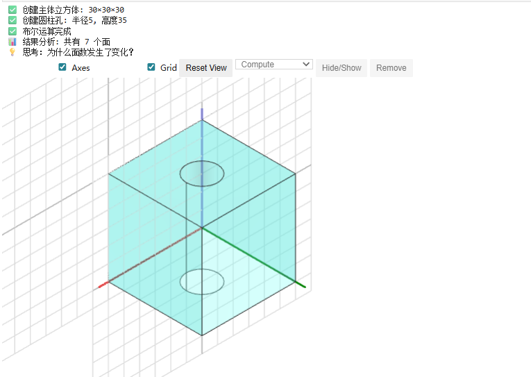
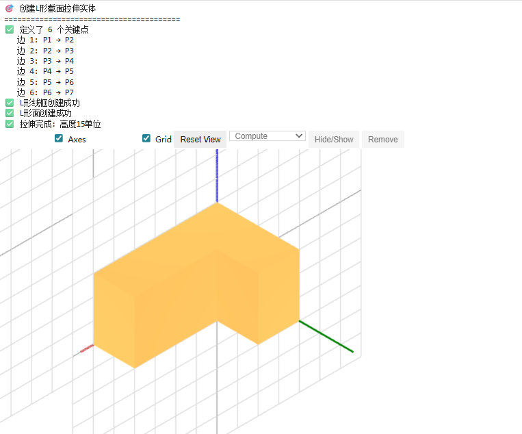
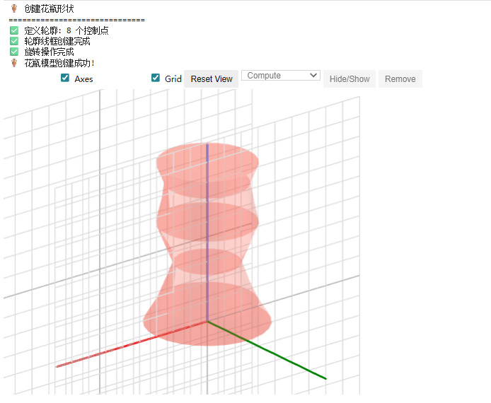
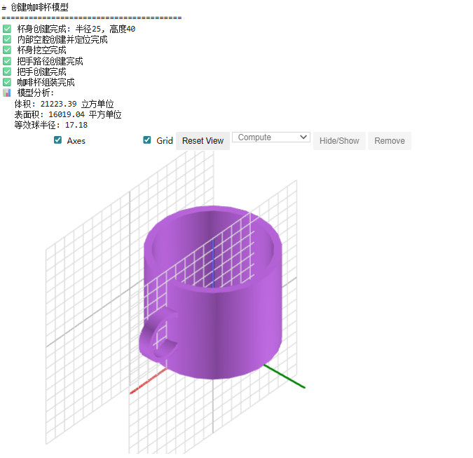

# ✅ 第2讲：Python 建模实战

> 本讲目标：掌握 PythonOCC 中的布尔运算和特征建模技术，学会创建复杂三维模型，为实际工程应用打下基础。

---

## 🎯 1. 布尔运算基础

### 📖 什么是布尔运算？

**布尔运算（Boolean Operations）** 是通过集合运算来组合多个三维实体的方法，是 CAD 建模中最核心的操作之一。

### 🔧 三种基本布尔运算

| 运算类型 | 英文 | 符号 | 描述 | 生活例子 |
|----------|------|------|------|----------|
| **并集** | Union | A ∪ B | 合并两个物体 | 两个气球粘在一起 |
| **交集** | Intersection | A ∩ B | 保留重叠部分 | 两个气球重叠的部分 |
| **差集** | Difference | A − B | 从A中减去B | 苹果上咬一口 |

### 🎨 可视化示例

```python
from OCC.Core.BRepPrimAPI import BRepPrimAPI_MakeBox, BRepPrimAPI_MakeSphere
from OCC.Core.BRepAlgoAPI import BRepAlgoAPI_Fuse, BRepAlgoAPI_Common, BRepAlgoAPI_Cut
from OCC.Core.gp import gp_Pnt, gp_Trsf, gp_Vec
from OCC.Core.BRepBuilderAPI import BRepBuilderAPI_Transform
from OCC.Display.WebGl.jupyter_renderer import JupyterRenderer

# 创建两个基本几何体
box = BRepPrimAPI_MakeBox(20, 20, 20).Shape()
sphere = BRepPrimAPI_MakeSphere(gp_Pnt(10, 10, 10), 15).Shape()

print("🎯 布尔运算演示")
print("=" * 50)

# 1. 并集运算 (Union)
union_op = BRepAlgoAPI_Fuse(box, sphere)
union_result = union_op.Shape()

# 2. 交集运算 (Intersection)  
intersection_op = BRepAlgoAPI_Common(box, sphere)
intersection_result = intersection_op.Shape()

# 3. 差集运算 (Difference)
difference_op = BRepAlgoAPI_Cut(box, sphere)
difference_result = difference_op.Shape()

# 可视化结果
renderer = JupyterRenderer()
renderer.DisplayShape(union_result, shape_color="#FF6B6B", transparency=0.7)
renderer.Display()
```

---

## 🏗️ 2. 实际建模案例：创建带孔立方体



### 🎯 案例目标
创建一个立方体，然后在其中心打一个圆柱形的孔。

```python
from OCC.Core.BRepPrimAPI import BRepPrimAPI_MakeBox, BRepPrimAPI_MakeCylinder
from OCC.Core.BRepAlgoAPI import BRepAlgoAPI_Cut
from OCC.Core.gp import gp_Pnt, gp_Ax2, gp_Dir
from OCC.Display.WebGl.jupyter_renderer import JupyterRenderer
def create_box_with_hole():
    """创建带孔的立方体"""
    
    # 1. 创建主体立方体 (30x30x30)
    main_box = BRepPrimAPI_MakeBox(30, 30, 30).Shape()
    print("✅ 创建主体立方体: 30×30×30")
    
    # 2. 创建圆柱孔 (半径5, 高度35 - 比立方体稍高确保完全穿透)
    cylinder_axis = gp_Ax2(gp_Pnt(15, 15, -2.5), gp_Dir(0, 0, 1))
    cylinder_hole = BRepPrimAPI_MakeCylinder(cylinder_axis, 5, 35).Shape()
    print("✅ 创建圆柱孔: 半径5, 高度35")
    
    # 3. 执行差集运算 (立方体 - 圆柱)
    cut_operation = BRepAlgoAPI_Cut(main_box, cylinder_hole)
    
    if cut_operation.IsDone():
        result = cut_operation.Shape()
        print("✅ 布尔运算完成")
        return result
    else:
        print("❌ 布尔运算失败")
        return None

# 执行建模
box_with_hole = create_box_with_hole()

if box_with_hole:
    # 分析结果
    from OCC.Core.TopExp import TopExp_Explorer
    from OCC.Core.TopAbs import TopAbs_FACE
    
    face_explorer = TopExp_Explorer(box_with_hole, TopAbs_FACE)
    face_count = 0
    while face_explorer.More():
        face_count += 1
        face_explorer.Next()
    
    print(f"📊 结果分析: 共有 {face_count} 个面")
    print("💡 思考：为什么面数发生了变化？")
    
    # 可视化
    renderer = JupyterRenderer()
    renderer.DisplayShape(box_with_hole, shape_color="#4ECDC4")
    renderer.Display()
```

---

## 🌀 3. 特征建模 - 拉伸（Extrusion）

### 📖 什么是拉伸？

**拉伸（Extrusion）** 是将二维轮廓沿指定方向拉伸形成三维实体的操作。



### 🎯 案例：从草图到实体

```python
from OCC.Core.gp import gp_Pnt, gp_Vec, gp_Dir
from OCC.Core.BRepBuilderAPI import BRepBuilderAPI_MakeEdge, BRepBuilderAPI_MakeWire, BRepBuilderAPI_MakeFace
from OCC.Core.BRepPrimAPI import BRepPrimAPI_MakePrism
from OCC.Core.GC import GC_MakeSegment, GC_MakeArcOfCircle

def create_L_shape_extrusion():
    """创建L形截面的拉伸实体"""
    
    print("🎯 创建L形截面拉伸实体")
    print("=" * 40)
    
    # 1. 定义L形轮廓的关键点
    points = [
        gp_Pnt(0, 0, 0),    # P1: 起点
        gp_Pnt(30, 0, 0),   # P2: 底边右端
        gp_Pnt(30, 10, 0),  # P3: 短边顶端
        gp_Pnt(10, 10, 0),  # P4: 内角点
        gp_Pnt(10, 20, 0),  # P5: 长边底端
        gp_Pnt(0, 20, 0),   # P6: 长边顶端
        gp_Pnt(0, 0, 0)     # P7: 回到起点（闭合）
    ]
    
    print(f"✅ 定义了 {len(points)-1} 个关键点")
    
    # 2. 创建边
    edges = []
    for i in range(len(points)-1):
        edge = BRepBuilderAPI_MakeEdge(points[i], points[i+1]).Edge()
        edges.append(edge)
        print(f"   边 {i+1}: P{i+1} → P{i+2}")
    
    # 3. 组装线框 (Wire)
    wire_maker = BRepBuilderAPI_MakeWire()
    for edge in edges:
        wire_maker.Add(edge)
    
    if wire_maker.IsDone():
        L_wire = wire_maker.Wire()
        print("✅ L形线框创建成功")
    else:
        print("❌ 线框创建失败")
        return None
    
    # 4. 创建面 (Face)
    L_face = BRepBuilderAPI_MakeFace(L_wire).Face()
    print("✅ L形面创建成功")
    
    # 5. 拉伸成实体 (向Z方向拉伸15单位)
    extrusion_vector = gp_Vec(0, 0, 15)
    L_solid = BRepPrimAPI_MakePrism(L_face, extrusion_vector).Shape()
    print("✅ 拉伸完成: 高度15单位")
    
    return L_solid

# 执行建模
L_shape = create_L_shape_extrusion()

if L_shape:
    # 可视化
    renderer = JupyterRenderer()
    renderer.DisplayShape(L_shape, shape_color="#FF9F43")
    renderer.Display()
```

---

## 🌪️ 4. 特征建模 - 旋转（Revolution）

### 📖 什么是旋转？

**旋转（Revolution）** 是将二维轮廓绕指定轴线旋转形成三维实体的操作。

### 🎯 案例：创建花瓶形状



```python
from OCC.Core.BRepPrimAPI import BRepPrimAPI_MakeRevol
from OCC.Core.gp import gp_Pnt, gp_Ax1, gp_Dir
from OCC.Core.BRepBuilderAPI import BRepBuilderAPI_MakeEdge,BRepBuilderAPI_MakeWire
from OCC.Display.WebGl.jupyter_renderer import JupyterRenderer
import math


def create_vase_by_revolution():
    """通过旋转创建花瓶形状"""
    
    print("🏺 创建花瓶形状")
    print("=" * 30)
    
    # 1. 定义花瓶的轮廓线（半边轮廓）
    profile_points = [
        gp_Pnt(0, 0, 0),      # 底部中心
        gp_Pnt(15, 0, 0),     # 底部外边
        gp_Pnt(12, 0, 5),     # 底部收缩
        gp_Pnt(8, 0, 15),     # 腰部最细
        gp_Pnt(12, 0, 25),    # 肚子部分
        gp_Pnt(10, 0, 35),    # 颈部
        gp_Pnt(12, 0, 40),    # 瓶口
        gp_Pnt(0, 0, 40)      # 顶部中心
    ]
    
    print(f"✅ 定义轮廓: {len(profile_points)} 个控制点")
    
    # 2. 创建轮廓边
    profile_edges = []
    for i in range(len(profile_points)-1):
        edge = BRepBuilderAPI_MakeEdge(profile_points[i], profile_points[i+1]).Edge()
        profile_edges.append(edge)
    
    # 3. 组装轮廓线框
    profile_wire_maker = BRepBuilderAPI_MakeWire()
    for edge in profile_edges:
        profile_wire_maker.Add(edge)
    
    profile_wire = profile_wire_maker.Wire()
    print("✅ 轮廓线框创建完成")
    
    # 4. 定义旋转轴 (Z轴)
    rotation_axis = gp_Ax1(gp_Pnt(0, 0, 0), gp_Dir(0, 0, 1))
    
    # 5. 执行旋转 (360度 = 2π弧度)
    revolution_operation = BRepPrimAPI_MakeRevol(profile_wire, rotation_axis, 2 * math.pi)
    vase = revolution_operation.Shape()
    
    print("✅ 旋转操作完成")
    print("🏺 花瓶模型创建成功!")
    
    return vase

# 执行建模
vase_shape = create_vase_by_revolution()

if vase_shape:
    # 可视化
    renderer = JupyterRenderer()
    renderer.DisplayShape(vase_shape, shape_color="#E74C3C", transparency=True,opacity = 0.3)
    renderer.Display()
```

---

## 🔗 5. 复合建模：组合多种特征



### 🎯 综合案例：创建带把手的杯子

```python
from OCC.Core.BRepPrimAPI import BRepPrimAPI_MakeRevol,BRepPrimAPI_MakeCylinder
from OCC.Core.gp import gp_Pnt, gp_Ax1, gp_Dir,gp_Trsf,gp_Vec,gp_Ax2
from OCC.Core.BRepBuilderAPI import BRepBuilderAPI_MakeEdge,BRepBuilderAPI_MakeWire,BRepBuilderAPI_Transform
from OCC.Core.BRepAlgoAPI import BRepAlgoAPI_Cut,BRepAlgoAPI_Fuse
from OCC.Display.WebGl.jupyter_renderer import JupyterRenderer
import math

def create_coffee_mug():
    """创建一个带把手的咖啡杯"""
    
    print("☕ 创建咖啡杯模型")
    print("=" * 40)
    
    # 1. 创建杯身（圆柱体）
    cup_body = BRepPrimAPI_MakeCylinder(25, 40).Shape()
    print("✅ 杯身创建完成: 半径25, 高度40")
    
    # 2. 创建内部空腔（稍小的圆柱体）
    inner_cavity = BRepPrimAPI_MakeCylinder(22, 38).Shape()
    
    # 移动内部空腔向上2单位（留底部厚度）
    transform = gp_Trsf()
    transform.SetTranslation(gp_Vec(0, 0, 2))
    moved_cavity = BRepBuilderAPI_Transform(inner_cavity, transform).Shape()
    print("✅ 内部空腔创建并定位完成")
    
    # 3. 挖空杯身（杯身 - 内部空腔）
    hollow_operation = BRepAlgoAPI_Cut(cup_body, moved_cavity)
    hollow_cup = hollow_operation.Shape()
    print("✅ 杯身挖空完成")
    
    # 4. 创建把手（环形拉伸）
    # 创建把手的截面轮廓（圆形）
    handle_center = gp_Pnt(35, 0, 20)  # 把手中心位置
    handle_profile = BRepPrimAPI_MakeCylinder(3, 5).Shape()  # 截面圆
    
    # 把手路径（半圆弧）
    import math
    handle_points = []
    for angle in range(0, 181, 20):  # 0到180度，步长20度
        rad = math.radians(angle)
        x = 35 + 8 * math.cos(rad)
        y = 8 * math.sin(rad)
        z = 20
        handle_points.append(gp_Pnt(x, y, z))
    
    # 创建把手路径
    handle_edges = []
    for i in range(len(handle_points)-1):
        edge = BRepBuilderAPI_MakeEdge(handle_points[i], handle_points[i+1]).Edge()
        handle_edges.append(edge)
    
    handle_wire_maker = BRepBuilderAPI_MakeWire()
    for edge in handle_edges:
        handle_wire_maker.Add(edge)
    handle_path = handle_wire_maker.Wire()
    
    print("✅ 把手路径创建完成")
    
    # 5. 创建把手（圆形截面沿路径扫掠）
    # 简化版：使用环形近似把手
    handle_torus = BRepPrimAPI_MakeCylinder(
        gp_Ax2(gp_Pnt(30, 0, 20), gp_Dir(0, 1, 0)), 10, 5
    ).Shape()
    
    # 创建把手孔
    handle_hole = BRepPrimAPI_MakeCylinder(
        gp_Ax2(gp_Pnt(30, -1, 20), gp_Dir(0, 1, 0)), 8, 17
    ).Shape()
    
    handle_solid = BRepAlgoAPI_Cut(handle_torus, handle_hole).Shape()
    print("✅ 把手创建完成")
    
    # 6. 组合杯身和把手
    final_mug = BRepAlgoAPI_Fuse(hollow_cup, handle_solid).Shape()
    print("✅ 咖啡杯组装完成")
    
    return final_mug

# 执行建模
coffee_mug = create_coffee_mug()

if coffee_mug:
    # 分析模型
    def analyze_shape_advanced(shape):
        """分析形状的高级属性"""
        from OCC.Core.GProp import GProp_GProps
        from OCC.Core.BRepGProp import brepgprop_VolumeProperties, brepgprop_SurfaceProperties
        
        # 体积和表面积
        props = GProp_GProps()
        brepgprop_VolumeProperties(shape, props)
        volume = props.Mass()
        
        surf_props = GProp_GProps()
        brepgprop_SurfaceProperties(shape, surf_props)
        surface_area = surf_props.Mass()
        
        print(f"📊 模型分析:")
        print(f"   体积: {volume:.2f} 立方单位")
        print(f"   表面积: {surface_area:.2f} 平方单位")
        print(f"   等效球半径: {(3*volume/(4*math.pi))**(1/3):.2f}")
    
    analyze_shape_advanced(coffee_mug)
    
    # 可视化
    renderer = JupyterRenderer()
    renderer.DisplayShape(coffee_mug, shape_color="#8E44AD")
    renderer.Display()
```

---

## ⚠️ 6. 常见问题与调试技巧

### 🚨 布尔运算常见错误

| 错误类型 | 症状 | 可能原因 | 解决方案 |
|----------|------|----------|----------|
| **运算失败** | `IsDone()` 返回 `False` | 几何体不相交或有缺陷 | 检查几何体位置，使用 `ShapeFix` 修复 |
| **结果为空** | 得到空的 Shape | 运算对象没有重叠 | 调整几何体位置，确保有交集 |
| **表面破损** | 可视化出现孔洞 | 精度问题或拓扑错误 | 调整 `Precision` 设置 |
| **性能慢** | 计算时间过长 | 几何体过于复杂 | 简化模型或使用近似方法 |

### 🔧 调试技巧

```python
def debug_boolean_operation(shape1, shape2, operation_type="fuse"):
    """调试布尔运算的工具函数"""
    
    print(f"🔍 调试布尔运算: {operation_type}")
    print("=" * 40)
    
    # 1. 检查输入形状
    from OCC.Core.BRepCheck import BRepCheck_Analyzer
    
    check1 = BRepCheck_Analyzer(shape1)
    check2 = BRepCheck_Analyzer(shape2)
    
    print(f"输入形状1有效性: {'✅ 有效' if check1.IsValid() else '❌ 无效'}")
    print(f"输入形状2有效性: {'✅ 有效' if check2.IsValid() else '❌ 无效'}")
    
    # 2. 检查边界框重叠
    from OCC.Core.Bnd import Bnd_Box
    from OCC.Core.BRepBndLib import brepbndlib_Add
    
    box1, box2 = Bnd_Box(), Bnd_Box()
    brepbndlib_Add(shape1, box1)
    brepbndlib_Add(shape2, box2)
    
    if not box1.IsOut(box2):
        print("✅ 边界框有重叠，可以进行布尔运算")
    else:
        print("❌ 边界框无重叠，布尔运算可能失败")
    
    # 3. 执行运算并检查结果
    try:
        if operation_type == "fuse":
            op = BRepAlgoAPI_Fuse(shape1, shape2)
        elif operation_type == "cut":
            op = BRepAlgoAPI_Cut(shape1, shape2)
        elif operation_type == "common":
            op = BRepAlgoAPI_Common(shape1, shape2)
        
        if op.IsDone():
            result = op.Shape()
            result_check = BRepCheck_Analyzer(result)
            print(f"运算结果: {'✅ 成功' if result_check.IsValid() else '❌ 有问题'}")
            return result
        else:
            print("❌ 运算执行失败")
            return None
            
    except Exception as e:
        print(f"❌ 运算异常: {e}")
        return None

# 使用示例
box = BRepPrimAPI_MakeBox(10, 10, 10).Shape()
sphere = BRepPrimAPI_MakeSphere(gp_Pnt(5, 5, 5), 7).Shape()
result = debug_boolean_operation(box, sphere, "fuse")
```

---

## 📏 7. 几何属性计算

```python
def calculate_geometric_properties(shape):
    """计算几何体的各种属性"""
    
    from OCC.Core.GProp import GProp_GProps
    from OCC.Core.BRepGProp import (
        brepgprop_VolumeProperties, 
        brepgprop_SurfaceProperties,
        brepgprop_LinearProperties
    )
    
    print("📏 几何属性计算")
    print("=" * 30)
    
    # 体积属性
    volume_props = GProp_GProps()
    brepgprop_VolumeProperties(shape, volume_props)
    volume = volume_props.Mass()
    center_of_mass = volume_props.CentreOfMass()
    
    # 表面积属性
    surface_props = GProp_GProps()
    brepgprop_SurfaceProperties(shape, surface_props)
    surface_area = surface_props.Mass()
    
    # 惯性矩
    inertia_matrix = volume_props.MatrixOfInertia()
    
    print(f"体积: {volume:.4f}")
    print(f"表面积: {surface_area:.4f}")
    print(f"质心位置: ({center_of_mass.X():.2f}, {center_of_mass.Y():.2f}, {center_of_mass.Z():.2f})")
    print(f"密度比（假设密度=1）: {volume/surface_area:.4f}")
    
    return {
        'volume': volume,
        'surface_area': surface_area,
        'center_of_mass': center_of_mass,
        'compactness': volume / surface_area
    }

# 测试不同几何体
test_shapes = {
    '立方体': BRepPrimAPI_MakeBox(10, 10, 10).Shape(),
    '球体': BRepPrimAPI_MakeSphere(6.2).Shape(),  # 相同体积的球
    '圆柱': BRepPrimAPI_MakeCylinder(5.64, 10).Shape()  # 相同体积的圆柱
}

for name, shape in test_shapes.items():
    print(f"\n🔸 {name}:")
    props = calculate_geometric_properties(shape)
```

---

## 🧰 8. 实用工具函数

```python
def create_rounded_box(length, width, height, fillet_radius):
    """创建圆角立方体"""
    from OCC.Core.BRepFilletAPI import BRepFilletAPI_MakeFillet
    from OCC.Core.TopExp import TopExp_Explorer
    from OCC.Core.TopAbs import TopAbs_EDGE
    
    # 创建基础立方体
    box = BRepPrimAPI_MakeBox(length, width, height).Shape()
    
    # 添加圆角
    fillet_maker = BRepFilletAPI_MakeFillet(box)
    
    # 遍历所有边，添加圆角
    edge_explorer = TopExp_Explorer(box, TopAbs_EDGE)
    while edge_explorer.More():
        edge = edge_explorer.Current()
        fillet_maker.Add(fillet_radius, edge)
        edge_explorer.Next()
    
    fillet_maker.Build()
    if fillet_maker.IsDone():
        return fillet_maker.Shape()
    else:
        print("圆角创建失败")
        return box

def create_pipe_with_thickness(radius_outer, radius_inner, height):
    """创建管道（空心圆柱）"""
    
    # 外圆柱
    outer_cylinder = BRepPrimAPI_MakeCylinder(radius_outer, height).Shape()
    
    # 内圆柱（稍高一点确保完全穿透）
    inner_cylinder = BRepPrimAPI_MakeCylinder(radius_inner, height + 2).Shape()
    
    # 向下移动内圆柱
    transform = gp_Trsf()
    transform.SetTranslation(gp_Vec(0, 0, -1))
    moved_inner = BRepBuilderAPI_Transform(inner_cylinder, transform).Shape()
    
    # 差集运算
    pipe = BRepAlgoAPI_Cut(outer_cylinder, moved_inner).Shape()
    return pipe

# 使用示例
rounded_box = create_rounded_box(20, 15, 10, 2)
pipe = create_pipe_with_thickness(10, 7, 25)

# 可视化
renderer = JupyterRenderer()
renderer.DisplayShape(rounded_box, shape_color="#3498DB")
renderer.DisplayShape(pipe, shape_color="#E67E22")
renderer.Display()
```

---

## 📘 拓展阅读

- **布尔运算理论**：[OpenCASCADE Boolean Operations](https://dev.opencascade.org/doc/occt-7.4.0/overview/html/occt_user_guides__boolean_operations.html#:~:text=The%20Boolean%20operator%20provides%20the%20operations%20%28Common%2C%20Fuse%2C,%7BS11%2C%20S12%20...%20S1n1%7D%20group%20of%20arguments%20%28Objects%29%3B)
- **几何属性**：[Global Properties](https://dev.opencascade.org/doc/refman/html/package_gprop.html)

---

## 🧪 课后作业

### 📝 基础作业

1. **🔧 布尔运算练习**
   - 创建两个重叠的立方体，分别执行并集、交集、差集运算
   - 观察并描述三种运算的结果差异

2. **🏗️ 拉伸建模**
   - 创建一个T字形截面，将其拉伸成实体
   - 尝试修改T字形的尺寸，观察拉伸结果的变化

3. **🌪️ 旋转建模**
   - 设计一个简单的轮廓（如三角形或梯形），绕轴旋转形成实体
   - 尝试只旋转180度，观察与360度旋转的区别

### 🚀 进阶作业

4. **⚙️ 齿轮建模**
   - 创建一个简化的齿轮模型（提示：可以用多个小立方体从圆盘中减去）
   - 计算齿轮的体积和表面积

5. **🏠 建筑模型**
   - 设计一个简单的房子模型，包含：
     - 主体（立方体）
     - 屋顶（三角棱镜）
     - 门窗（通过差集运算创建）

6. **☕ 复杂杯子**
   - 改进课程中的咖啡杯模型：
     - 添加杯底的厚度
     - 创建更逼真的把手形状
     - 在杯身上添加装饰性凹槽

### 💡 挑战题

7. **🔧 螺栓建模**
   - 创建一个完整的螺栓模型，包括：
     - 螺栓头（六角形）
     - 螺栓杆（圆柱形）
     - 螺纹（可以用螺旋扫掠或简化的环形凹槽）

8. **🎭 自由创作**
   - 设计并实现一个你感兴趣的三维模型
   - 要求至少使用3种不同的建模技术（布尔运算、拉伸、旋转等）
   - 计算模型的几何属性并进行分析

### 🤔 思考题

9. **理论思考**
   - 为什么布尔运算有时会失败？在实际CAD软件中如何避免这些问题？
   - 拉伸和旋转哪种建模方式更高效？在什么情