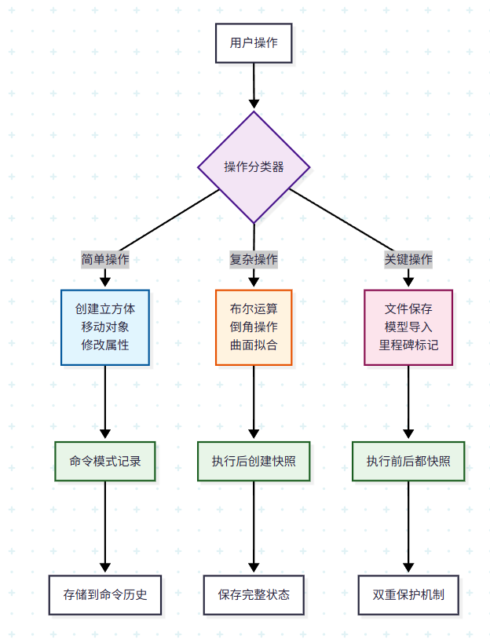
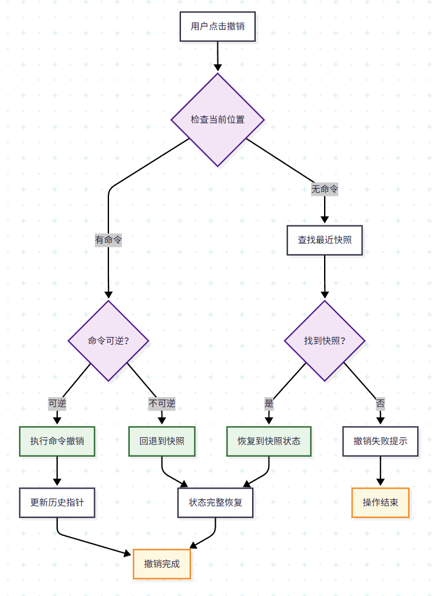

# ✅ 第3讲：CAD 软件中的 Undo/Redo 机制

> 本讲目标：理解 CAD 软件中撤销/重做机制的实现原理，掌握命令模式和快照模式两种主要策略，学会设计混合式 Undo/Redo 系统，为构建工业级 CAD 应用打下基础。

---

## 🏗️ 1. CAD 软件中的 Undo/Redo 现状分析

### 📊 主流 CAD 软件的策略对比

| CAD 软件 | 主要策略 | 特点 | 优势 | 局限性 |
|----------|----------|------|------|--------|
| [**AutoCAD**](https://www.peachpit.com/articles/article.aspx?p=2982117&seqNum=6) | 命令模式 + 部分快照 | 每个命令可撤销，支持深度撤销 | 内存效率高，响应快速 | 复杂操作难以完全恢复 |
| [**SolidWorks**](https://www.reddit.com/r/SolidWorks/comments/12lup74/solidworks_is_slow_as_hell_even_on_pc_with_high/) | 特征树 + 快照 | 基于特征历史的撤销 | 参数化建模友好 | 特征依赖复杂时性能下降 |
| [**Fusion 360**](https://www.autodesk.com/products/fusion-360/blog/how-to-capture-or-revert-autodesk-fusion/) | 混合模式 | 云端快照 + 本地命令 | 可跨设备同步历史 | 网络依赖，存储成本高 |


### 🎯 CAD 领域的特殊需求

CAD 软件的 Undo/Redo 机制面临独特挑战：

- **🔧 操作复杂性**：一次建模操作可能涉及多个几何体和拓扑关系
- **📈 数据量大**：三维模型数据结构庞大，完整快照成本高
- **🔗 依赖关系**：几何特征间存在复杂的父子依赖关系
- **⚡ 实时性要求**：用户期望撤销操作响应迅速
- **💾 内存限制**：需要在功能完整性和内存占用间平衡

---

## 🎨 2. 命令模式（Command Pattern）基础

### 📖 什么是命令模式？

**命令模式**是一种行为设计模式，它将请求封装成对象，使你可以用不同的请求对客户进行参数化，对请求排队或记录请求日志，以及支持可撤销的操作。

### 🏛️ 命令模式的核心结构

```python
from abc import ABC, abstractmethod
from typing import List, Any
import copy

class Command(ABC):
    """命令抽象基类"""
    
    @abstractmethod
    def execute(self) -> Any:
        """执行命令"""
        pass
    
    @abstractmethod
    def undo(self) -> Any:
        """撤销命令"""
        pass
    
    @abstractmethod
    def get_description(self) -> str:
        """获取命令描述"""
        pass

class Receiver:
    """接收者 - 实际执行操作的对象"""
    
    def __init__(self):
        self.shapes = []  # 存储几何体
        self.current_id = 0
    
    def add_shape(self, shape_data):
        """添加几何体"""
        shape_id = self.current_id
        self.shapes.append({
            'id': shape_id,
            'data': shape_data,
            'active': True
        })
        self.current_id += 1
        print(f"✅ 添加几何体 ID: {shape_id}")
        return shape_id
    
    def remove_shape(self, shape_id):
        """删除几何体"""
        for shape in self.shapes:
            if shape['id'] == shape_id and shape['active']:
                shape['active'] = False
                print(f"🗑️ 删除几何体 ID: {shape_id}")
                return True
        return False
    
    def restore_shape(self, shape_id):
        """恢复几何体"""
        for shape in self.shapes:
            if shape['id'] == shape_id and not shape['active']:
                shape['active'] = True
                print(f"🔄 恢复几何体 ID: {shape_id}")
                return True
        return False
    
    def get_active_shapes(self):
        """获取当前活跃的几何体"""
        return [s for s in self.shapes if s['active']]

class Invoker:
    """调用者 - 管理命令历史"""
    
    def __init__(self):
        self.history: List[Command] = []
        self.current_index = -1
    
    def execute_command(self, command: Command):
        """执行命令并记录到历史"""
        # 如果当前不在历史末尾，删除后续历史
        if self.current_index < len(self.history) - 1:
            self.history = self.history[:self.current_index + 1]
        
        # 执行命令
        result = command.execute()
        
        # 添加到历史
        self.history.append(command)
        self.current_index += 1
        
        print(f"📝 执行命令: {command.get_description()}")
        return result
    
    def undo(self):
        """撤销操作"""
        if self.can_undo():
            command = self.history[self.current_index]
            result = command.undo()
            self.current_index -= 1
            print(f"↩️ 撤销命令: {command.get_description()}")
            return result
        else:
            print("❌ 无可撤销的操作")
            return None
    
    def redo(self):
        """重做操作"""
        if self.can_redo():
            self.current_index += 1
            command = self.history[self.current_index]
            result = command.execute()
            print(f"↪️ 重做命令: {command.get_description()}")
            return result
        else:
            print("❌ 无可重做的操作")
            return None
    
    def can_undo(self) -> bool:
        """是否可以撤销"""
        return self.current_index >= 0
    
    def can_redo(self) -> bool:
        """是否可以重做"""
        return self.current_index < len(self.history) - 1
    
    def get_history_summary(self):
        """获取历史记录摘要"""
        print(f"📚 命令历史 (当前位置: {self.current_index + 1}/{len(self.history)}):")
        for i, cmd in enumerate(self.history):
            marker = "➤" if i == self.current_index else " "
            print(f"  {marker} {i}: {cmd.get_description()}")
```

### 🔧 具体命令实现

```python
from OCC.Core.BRepPrimAPI import BRepPrimAPI_MakeBox, BRepPrimAPI_MakeSphere
from OCC.Core.gp import gp_Pnt

class CreateBoxCommand(Command):
    """创建立方体命令"""
    
    def __init__(self, receiver: Receiver, width: float, height: float, depth: float):
        self.receiver = receiver
        self.width = width
        self.height = height
        self.depth = depth
        self.shape_id = None
    
    def execute(self):
        """执行：创建立方体"""
        box_shape = BRepPrimAPI_MakeBox(self.width, self.height, self.depth).Shape()
        self.shape_id = self.receiver.add_shape({
            'type': 'box',
            'width': self.width,
            'height': self.height,
            'depth': self.depth,
            'shape': box_shape
        })
        return self.shape_id
    
    def undo(self):
        """撤销：删除立方体"""
        if self.shape_id is not None:
            return self.receiver.remove_shape(self.shape_id)
        return False
    
    def get_description(self) -> str:
        return f"创建立方体 ({self.width}×{self.height}×{self.depth})"

class CreateSphereCommand(Command):
    """创建球体命令"""
    
    def __init__(self, receiver: Receiver, center: gp_Pnt, radius: float):
        self.receiver = receiver
        self.center = center
        self.radius = radius
        self.shape_id = None
    
    def execute(self):
        """执行：创建球体"""
        sphere_shape = BRepPrimAPI_MakeSphere(self.center, self.radius).Shape()
        self.shape_id = self.receiver.add_shape({
            'type': 'sphere',
            'center': self.center,
            'radius': self.radius,
            'shape': sphere_shape
        })
        return self.shape_id
    
    def undo(self):
        """撤销：删除球体"""
        if self.shape_id is not None:
            return self.receiver.remove_shape(self.shape_id)
        return False
    
    def get_description(self) -> str:
        return f"创建球体 (半径: {self.radius})"

class DeleteShapeCommand(Command):
    """删除几何体命令"""
    
    def __init__(self, receiver: Receiver, shape_id: int):
        self.receiver = receiver
        self.shape_id = shape_id
    
    def execute(self):
        """执行：删除几何体"""
        return self.receiver.remove_shape(self.shape_id)
    
    def undo(self):
        """撤销：恢复几何体"""
        return self.receiver.restore_shape(self.shape_id)
    
    def get_description(self) -> str:
        return f"删除几何体 (ID: {self.shape_id})"
```

### 🧪 命令模式示例

```python
def command_pattern_demo():
    """命令模式演示"""
    
    print("🎯 命令模式 Undo/Redo 演示")
    print("=" * 50)
    
    # 创建接收者和调用者
    receiver = Receiver()
    invoker = Invoker()
    
    # 创建几个命令
    cmd1 = CreateBoxCommand(receiver, 10, 20, 30)
    cmd2 = CreateSphereCommand(receiver, gp_Pnt(0, 0, 0), 15)
    cmd3 = CreateBoxCommand(receiver, 5, 5, 5)
    
    # 执行命令
    print("\n📝 执行命令序列:")
    invoker.execute_command(cmd1)
    invoker.execute_command(cmd2)
    invoker.execute_command(cmd3)
    
    print(f"\n当前活跃几何体数量: {len(receiver.get_active_shapes())}")
    
    # 撤销操作
    print("\n↩️ 撤销操作:")
    invoker.undo()  # 撤销创建小立方体
    invoker.undo()  # 撤销创建球体
    
    print(f"撤销后活跃几何体数量: {len(receiver.get_active_shapes())}")
    
    # 重做操作
    print("\n↪️ 重做操作:")
    invoker.redo()  # 重做创建球体
    
    print(f"重做后活跃几何体数量: {len(receiver.get_active_shapes())}")
    
    # 显示历史记录
    print("\n")
    invoker.get_history_summary()
    
    # 新命令会清除后续历史
    print("\n📝 执行新命令（将清除后续历史）:")
    cmd4 = CreateSphereCommand(receiver, gp_Pnt(10, 10, 10), 8)
    invoker.execute_command(cmd4)
    
    print("\n")
    invoker.get_history_summary()

# 运行演示
command_pattern_demo()
```

---

## 📷 3. 快照模式（Snapshot/Memento Pattern）

### 📖 什么是快照模式？

**快照模式**通过保存对象在特定时刻的完整状态来实现撤销功能。就像给整个模型拍照，需要时可以直接恢复到某个照片的状态。

### 🏛️ 快照模式的核心结构

```python
import pickle
import time
from typing import Dict, Any, Optional
import copy

class Memento:
    """备忘录类 - 存储状态快照"""
    
    def __init__(self, state: Any, timestamp: float, description: str):
        self._state = copy.deepcopy(state)  # 深拷贝状态
        self._timestamp = timestamp
        self._description = description
        self._size = self._calculate_size()
    
    def get_state(self):
        """获取状态（返回深拷贝）"""
        return copy.deepcopy(self._state)
    
    def get_timestamp(self) -> float:
        """获取时间戳"""
        return self._timestamp
    
    def get_description(self) -> str:
        """获取描述"""
        return self._description
    
    def get_size(self) -> int:
        """获取快照大小（字节）"""
        return self._size
    
    def _calculate_size(self) -> int:
        """计算快照数据大小"""
        try:
            return len(pickle.dumps(self._state))
        except:
            return 0

class CADModel:
    """CAD 模型类 - 原发器（Originator）"""
    
    def __init__(self):
        self.shapes = {}
        self.next_id = 0
        self.properties = {
            'units': 'mm',
            'precision': 0.01,
            'author': 'CAD User'
        }
    
    def add_shape(self, shape_type: str, **kwargs) -> int:
        """添加几何体"""
        shape_id = self.next_id
        self.shapes[shape_id] = {
            'id': shape_id,
            'type': shape_type,
            'created_time': time.time(),
            **kwargs
        }
        self.next_id += 1
        print(f"✅ 添加 {shape_type} (ID: {shape_id})")
        return shape_id
    
    def remove_shape(self, shape_id: int) -> bool:
        """删除几何体"""
        if shape_id in self.shapes:
            del self.shapes[shape_id]
            print(f"🗑️ 删除几何体 (ID: {shape_id})")
            return True
        return False
    
    def modify_shape(self, shape_id: int, **kwargs):
        """修改几何体属性"""
        if shape_id in self.shapes:
            self.shapes[shape_id].update(kwargs)
            print(f"🔧 修改几何体 (ID: {shape_id})")
            return True
        return False
    
    def get_model_info(self) -> Dict:
        """获取模型信息"""
        return {
            'shape_count': len(self.shapes),
            'shape_types': [s['type'] for s in self.shapes.values()],
            'properties': self.properties
        }
    
    def create_memento(self, description: str = "") -> Memento:
        """创建快照"""
        state = {
            'shapes': self.shapes,
            'next_id': self.next_id,
            'properties': self.properties
        }
        return Memento(state, time.time(), description)
    
    def restore_from_memento(self, memento: Memento):
        """从快照恢复"""
        state = memento.get_state()
        self.shapes = state['shapes']
        self.next_id = state['next_id']
        self.properties = state['properties']
        print(f"🔄 恢复到快照: {memento.get_description()}")

class SnapshotManager:
    """快照管理器 - 负责人（Caretaker）"""
    
    def __init__(self, max_snapshots: int = 10):
        self.snapshots: List[Memento] = []
        self.current_index = -1
        self.max_snapshots = max_snapshots
        self.total_size = 0
    
    def save_snapshot(self, model: CADModel, description: str = ""):
        """保存快照"""
        # 如果不在历史末尾，删除后续快照
        if self.current_index < len(self.snapshots) - 1:
            removed_snapshots = self.snapshots[self.current_index + 1:]
            for snapshot in removed_snapshots:
                self.total_size -= snapshot.get_size()
            self.snapshots = self.snapshots[:self.current_index + 1]
        
        # 创建新快照
        memento = model.create_memento(description)
        self.snapshots.append(memento)
        self.current_index += 1
        self.total_size += memento.get_size()
        
        # 限制快照数量
        while len(self.snapshots) > self.max_snapshots:
            removed = self.snapshots.pop(0)
            self.total_size -= removed.get_size()
            self.current_index -= 1
        
        print(f"💾 保存快照: {description} ({memento.get_size()} 字节)")
        self._print_memory_usage()
    
    def undo(self, model: CADModel) -> bool:
        """撤销到上一个快照"""
        if self.current_index > 0:
            self.current_index -= 1
            snapshot = self.snapshots[self.current_index]
            model.restore_from_memento(snapshot)
            return True
        else:
            print("❌ 无可撤销的快照")
            return False
    
    def redo(self, model: CADModel) -> bool:
        """重做到下一个快照"""
        if self.current_index < len(self.snapshots) - 1:
            self.current_index += 1
            snapshot = self.snapshots[self.current_index]
            model.restore_from_memento(snapshot)
            return True
        else:
            print("❌ 无可重做的快照")
            return False
    
    def get_snapshot_history(self):
        """获取快照历史"""
        print(f"📚 快照历史 (当前位置: {self.current_index + 1}/{len(self.snapshots)}):")
        for i, snapshot in enumerate(self.snapshots):
            marker = "➤" if i == self.current_index else " "
            timestamp = time.strftime("%H:%M:%S", time.localtime(snapshot.get_timestamp()))
            size_kb = snapshot.get_size() / 1024
            print(f"  {marker} {i}: {snapshot.get_description()} [{timestamp}] ({size_kb:.1f}KB)")
    
    def _print_memory_usage(self):
        """打印内存使用情况"""
        total_mb = self.total_size / (1024 * 1024)
        print(f"📊 快照内存使用: {total_mb:.2f} MB ({len(self.snapshots)} 个快照)")
```

### 🧪 快照模式示例

```python
def snapshot_pattern_demo():
    """快照模式演示"""
    
    print("📷 快照模式 Undo/Redo 演示")
    print("=" * 50)
    
    # 创建模型和快照管理器
    model = CADModel()
    snapshot_manager = SnapshotManager(max_snapshots=5)
    
    # 初始快照
    snapshot_manager.save_snapshot(model, "初始状态")
    
    # 执行一系列操作
    print("\n📝 执行建模操作:")
    
    # 添加几何体
    box_id = model.add_shape('box', width=10, height=20, depth=30)
    snapshot_manager.save_snapshot(model, "添加立方体")
    
    sphere_id = model.add_shape('sphere', center=(0, 0, 0), radius=15)
    snapshot_manager.save_snapshot(model, "添加球体")
    
    cylinder_id = model.add_shape('cylinder', radius=8, height=25)
    snapshot_manager.save_snapshot(model, "添加圆柱体")
    
    # 修改几何体
    model.modify_shape(box_id, color='red', material='steel')
    snapshot_manager.save_snapshot(model, "修改立方体属性")
    
    print(f"\n当前模型信息: {model.get_model_info()}")
    
    # 撤销操作
    print("\n↩️ 撤销操作:")
    snapshot_manager.undo(model)  # 撤销属性修改
    snapshot_manager.undo(model)  # 撤销添加圆柱体
    
    print(f"撤销后模型信息: {model.get_model_info()}")
    
    # 重做操作
    print("\n↪️ 重做操作:")
    snapshot_manager.redo(model)   # 重做添加圆柱体
    
    print(f"重做后模型信息: {model.get_model_info()}")
    
    # 显示快照历史
    print("\n")
    snapshot_manager.get_snapshot_history()
    
    # 执行新操作（会清除后续快照）
    print("\n📝 执行新操作（将清除后续快照）:")
    model.add_shape('cone', radius=6, height=12)
    snapshot_manager.save_snapshot(model, "添加圆锥体")
    
    print("\n")
    snapshot_manager.get_snapshot_history()

# 运行演示
snapshot_pattern_demo()
```

---

## ⚖️ 4. 命令模式 vs 快照模式对比

### 📊 详细对比分析

| 特性 | 命令模式 | 快照模式 | 评分 |
|------|----------|----------|------|
| **内存效率** | 🟢 高（只存储操作信息） | 🔴 低（存储完整状态） | 命令模式胜 |
| **实现复杂度** | 🔴 高（需为每个操作写命令类） | 🟢 低（统一的快照机制） | 快照模式胜 |
| **撤销精度** | 🔴 中（依赖命令逆操作准确性） | 🟢 高（精确恢复到历史状态） | 快照模式胜 |
| **执行速度** | 🟢 快（增量操作） | 🔴 慢（完整状态恢复） | 命令模式胜 |
| **支持深度** | 🟢 深（受内存限制小） | 🔴 浅（受内存限制大） | 命令模式胜 |
| **数据一致性** | 🔴 风险（逆操作可能失败） | 🟢 安全（状态完整保存） | 快照模式胜 |
| **跨操作撤销** | 🔴 困难（复杂依赖关系） | 🟢 简单（直接状态切换） | 快照模式胜 |

### 💡 具体场景分析

```python
def performance_comparison():
    """性能对比测试"""
    
    print("⚡ 性能对比测试")
    print("=" * 40)
    
    import time
    import sys
    
    # 测试数据准备
    model = CADModel()
    snapshot_manager = SnapshotManager()
    command_receiver = Receiver()
    command_invoker = Invoker()
    
    # 命令模式测试
    print("🔧 命令模式性能测试:")
    start_time = time.time()
    start_memory = sys.getsizeof(command_invoker.history)
    
    for i in range(100):
        cmd = CreateBoxCommand(command_receiver, i+1, i+1, i+1)
        command_invoker.execute_command(cmd)
    
    command_time = time.time() - start_time
    command_memory = sys.getsizeof(command_invoker.history)
    
    print(f"   执行时间: {command_time:.4f} 秒")
    print(f"   内存占用: {(command_memory - start_memory) / 1024:.2f} KB")
    
    # 快照模式测试
    print("\n📷 快照模式性能测试:")
    start_time = time.time()
    start_memory = snapshot_manager.total_size
    
    for i in range(100):
        model.add_shape('box', width=i+1, height=i+1, depth=i+1)
        if i % 10 == 0:  # 每10次操作保存一次快照
            snapshot_manager.save_snapshot(model, f"操作 {i}")
    
    snapshot_time = time.time() - start_time
    snapshot_memory = snapshot_manager.total_size
    
    print(f"   执行时间: {snapshot_time:.4f} 秒")
    print(f"   内存占用: {(snapshot_memory - start_memory) / 1024:.2f} KB")
    
    # 撤销性能测试
    print("\n↩️ 撤销操作性能:")
    
    # 命令模式撤销
    start_time = time.time()
    for _ in range(10):
        command_invoker.undo()
    command_undo_time = time.time() - start_time
    
    # 快照模式撤销
    start_time = time.time()
    for _ in range(3):  # 快照较少，撤销次数也少
        snapshot_manager.undo(model)
    snapshot_undo_time = time.time() - start_time
    
    print(f"   命令模式撤销: {command_undo_time:.4f} 秒")
    print(f"   快照模式撤销: {snapshot_undo_time:.4f} 秒")

# 运行性能测试
performance_comparison()
```

---

## 🔄 5. 混合模式：命令+快照的最佳实践

### 🎯 为什么 CAD 领域需要混合模式？

在 CAD 软件中，单独使用命令模式或快照模式都有明显局限：

#### 🔧 命令模式的问题
- **复杂操作的逆向实现困难**：如布尔运算的撤销往往需要记录大量中间状态
- **依赖关系复杂时容易出错**：当几何体A依赖于几何体B时，删除B的撤销变得复杂
- **某些操作本质上不可逆**：如网格优化、曲面简化等操作很难精确逆转

#### 📷 快照模式的问题
- **内存消耗过大**：每个快照都保存完整状态，对于复杂模型不现实
- **频繁保存影响性能**：每次操作后都保存快照会严重影响建模流畅性
- **对简单操作过于"重量级"**：移动一个点也要保存整个模型状态

#### 🏗️ CAD 特殊需求
- **需要支持"关键节点"的精确恢复**：如设计阶段的里程碑版本
- **要求快速响应用户的撤销操作**：用户期望立即看到撤销效果
- **必须处理复杂的几何和拓扑关系**：BRep 模型的完整性要求很高

### 🏛️ 混合模式的设计思路

混合模式通过将操作分类来选择最适合的撤销策略：

```
简单操作 (Simple Operations)
├─ 创建基本几何体 (立方体、球体等)
├─ 移动、旋转、缩放
├─ 修改属性 (颜色、材质等)
└─ 策略：命令模式 (快速、轻量)

复杂操作 (Complex Operations)  
├─ 布尔运算 (并集、交集、差集)
├─ 倒角、圆角操作
├─ 网格简化、曲面拟合
└─ 策略：快照模式 (确保完整性)

关键操作 (Critical Operations)
├─ 文件保存
├─ 模型导入/导出
├─ 设计里程碑标记
└─ 策略：强制快照 (重要节点保护)
```

### 📊 混合模式的工作流程

#### 1. 操作分类与策略选择



#### 2. 撤销决策流程



#### 3. 自动快照策略

混合模式会在以下情况自动创建快照：

- **时间驱动**：每隔5-10分钟自动保存
- **操作计数驱动**：每执行10-20个简单命令后
- **内存压力驱动**：当命令历史占用过多内存时
- **复杂度驱动**：检测到复杂操作时立即快照

### 🎨 混合模式的优势

#### ✅ 性能优化
- 简单操作使用命令模式，响应速度快
- 复杂操作使用快照，确保可靠恢复
- 智能快照频率，平衡性能和功能

#### ✅ 内存效率
- 大部分操作只记录命令，内存占用小
- 关键节点保存完整状态，保证重要数据不丢失
- 压缩和增量快照进一步减少内存使用

#### ✅ 用户体验
- 撤销操作始终快速响应
- 支持深度撤销历史（通过命令链）
- 关键操作有可靠的恢复点

### 🔧 实际实现考虑

#### 1. 操作分类算法

```python
def classify_operation(operation_type, complexity_score, dependency_count):
    """
    操作分类算法示例
    
    Args:
        operation_type: 操作类型 ('create', 'modify', 'boolean', 'save', etc.)
        complexity_score: 复杂度评分 (1-100)
        dependency_count: 依赖关系数量
    
    Returns:
        'simple', 'complex', 或 'critical'
    """
    
    # 关键操作判断
    if operation_type in ['save', 'import', 'export', 'milestone']:
        return 'critical'
    
    # 复杂操作判断
    if (operation_type in ['boolean', 'fillet', 'mesh_simplify'] or 
        complexity_score > 50 or 
        dependency_count > 5):
        return 'complex'
    
    # 默认为简单操作
    return 'simple'
```

#### 2. 智能快照触发

```python
class SmartSnapshotTrigger:
    def __init__(self):
        self.last_snapshot_time = time.time()
        self.commands_since_snapshot = 0
        self.memory_threshold = 100 * 1024 * 1024  # 100MB
        
    def should_create_snapshot(self, context):
        """判断是否应该创建快照"""
        
        # 时间触发：超过10分钟
        if time.time() - self.last_snapshot_time > 600:
            return True, "时间触发"
            
        # 命令数量触发：超过20个命令
        if self.commands_since_snapshot > 20:
            return True, "命令数量触发"
            
        # 内存压力触发：超过阈值
        if context.get('memory_usage', 0) > self.memory_threshold:
            return True, "内存压力触发"
            
        # 用户行为触发：暂停操作超过30秒
        if context.get('idle_time', 0) > 30:
            return True, "用户暂停触发"
            
        return False, None
```

#### 3. 撤销策略选择

```python
class UndoStrategySelector:
    def select_undo_strategy(self, current_state, history):
        """选择最适合的撤销策略"""
        
        # 策略1：优先尝试命令撤销
        if self.can_command_undo(current_state, history):
            last_command = history.get_last_command()
            if last_command.is_reversible():
                return "command_undo", last_command
                
        # 策略2：回退到最近的可用快照
        nearest_snapshot = history.find_nearest_snapshot()
        if nearest_snapshot:
            return "snapshot_restore", nearest_snapshot
            
        # 策略3：无法撤销
        return "cannot_undo", None
```


### 🗄️ 持久化策略
这里的持久化策略的意思是将撤销数据保存为专用文件格式，与CAD模型文件关联，重点在于如何存储。
#### 1. 文件存储
文件存储的思想是将撤销数据以最小的方式存储在文件中，并且期望能够快速的读取原有的信息。
```
CAD_UNDO_FILE.cud (CAD Undo Data)
├─ Header (文件版本、元信息)
├─ Command Section (命令历史)
│   ├─ Command 1 (类型、参数、时间戳)
│   ├─ Command 2
│   └─ ...
├─ Snapshot Section (快照数据)
│   ├─ Snapshot 1 (压缩的模型状态)
│   ├─ Snapshot 2
│   └─ ...
└─ Index Section (快速查找索引)
```

#### 2. 数据库存储
数据库存储是通过表结构和blob的方式来存储，如果论单机性能的话比文件方式要慢，同时由于表结构的原因，体积还会大于采用紧凑二进制的文件存储方式。好处在于便于开发，支持多机器访问，并且有着自带的空间管理。
```sql
-- 撤销历史数据库设计
CREATE TABLE undo_sessions (
    session_id UUID PRIMARY KEY,
    model_id UUID,
    created_at TIMESTAMP,
    max_commands INTEGER,
    max_snapshots INTEGER
);

CREATE TABLE commands (
    id SERIAL PRIMARY KEY,
    session_id UUID REFERENCES undo_sessions,
    sequence_number INTEGER,
    command_type VARCHAR(50),
    command_data JSONB,
    created_at TIMESTAMP
);

CREATE TABLE snapshots (
    id SERIAL PRIMARY KEY,
    session_id UUID REFERENCES undo_sessions,
    sequence_number INTEGER,
    compressed_data BYTEA,
    compression_method VARCHAR(20),
    original_size BIGINT,
    created_at TIMESTAMP
);
```

## 🧪 课后作业

### 📝 基础作业

1. **🔧 命令模式实现**
   - 实现一个 `CreateSphereCommand` 类，支持创建和撤销球体
   - 实现一个 `MoveShapeCommand` 类，支持移动几何体的位置
   - 测试这两个命令的执行和撤销功能

2. **📷 快照模式实现**
   - 为 CADModel 类添加更多属性（如材质、颜色、图层等）
   - 实现一个简单的快照管理器，支持保存和恢复这些属性
   - 测试快照在不同操作后的恢复效果


### 🚀 进阶作业

3. **🔄 混合策略设计**
   - 设计一个操作分类器，能够将操作分为简单、复杂、关键三类
   - 实现基于操作类型的策略选择逻辑


### 🤔 思考题

4. **理论分析**
    - 在什么情况下，纯命令模式比混合模式更优？举出具体例子
    - CAD 软件中的"分支历史"（如Git的分支）是否有必要？如何实现？
    - 如何设计一个支持"选择性撤销"的系统（撤销历史中的某一步，而不影响后续操作）？


5. **实际应用**
    - 分析你使用过的CAD软件（如AutoCAD、SolidWorks等）的撤销行为，判断它们可能使用的策略
    - 对于AI辅助的CAD设计，撤销系统应该如何处理AI建议的操作？

---

## 📋 下节预告

**第4讲：从 Python 到 C++ 的迁移** 将学习：
- Python OCC 代码如何对应到 C++ OCCT
- C++ 环境搭建与项目配置  
- 实际的 C++ CAD 项目开发入门

---
