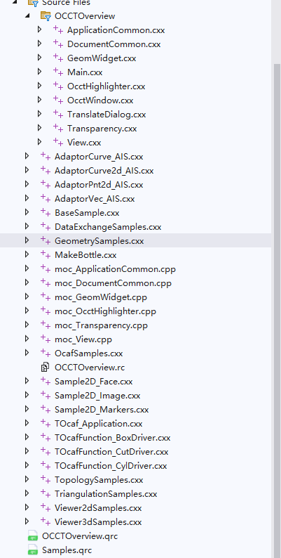
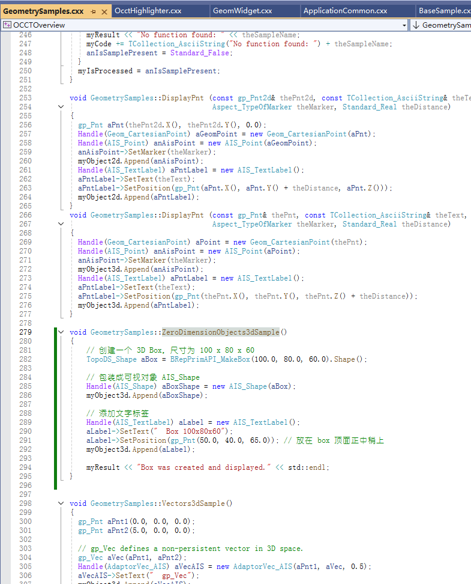
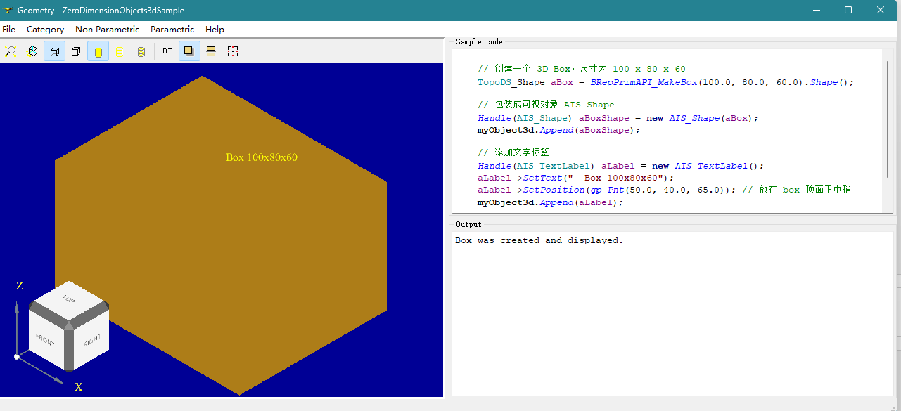

# ✅ 第5讲：使用 OCCT Overview 测试 C++ 代码

> 本讲目标：掌握使用 OCCT Overview 程序作为 C++ OCCT 代码的测试平台，学会通过修改示例代码来快速验证自己的几何建模实现，为独立的 C++ OCCT 开发打下实战基础。

---

## 🎯 1. 什么是 OCCT Overview？

### 📖 OCCT Overview 简介

**OCCT Overview** 是 OpenCASCADE 官方提供的一个综合性示例程序，它展示了 OCCT 库的各种功能特性。这个程序基于 Qt 框架构建，提供了友好的图形界面和丰富的示例代码。

### 🔧 为什么使用 OCCT Overview 作为测试平台？

| 优势 | 说明 |
|------|------|
| **环境已配置** | 无需从零搭建 OCCT + Qt 环境 |
| **可视化现成** | 内置 3D 显示和交互功能 |
| **示例丰富** | 包含大量可参考的实现代码 |
| **快速测试** | 可以立即看到代码运行效果 |
| **学习友好** | 通过修改现有代码逐步学习 |

### 🏗️ OCCT Overview 的结构





| 文件                      | 说明                     |
| ----------------------- | ---------------------- |
| `Main.cxx`              | 程序入口（main 函数），启动 Qt 应用 |
| `ApplicationCommon.cxx` | 应用初始化、全局设置等            |
| `DocumentCommon.cxx`    | 多文档结构支持                |
| `View.cxx`              | 封装交互视图操作，处理鼠标等事件       |
| `GeomWidget.cxx`        | Qt 界面中用于显示 3D 模型的组件    |
| `OcctWindow.cxx`        | 提供主窗口支持，嵌入 3D 场景       |
| `TranslateDialog.cxx`   | 数据导入导出对话框              |
| `Transparency.cxx`      | 控制模型透明度                |
| `OcctHighlighter.cxx`   | 用于代码/文本高亮功能            |


## 🔍 2. 定位和理解示例代码

### 🎯 目标：找到 "ZeroDimensionObjects3dSample"

我们将以 "ZeroDimensionObjects3dSample" 作为入门示例，这是一个相对简单的三维对象创建示例。

### 📋 步骤一：使用全局搜索定位代码

#### 在 Visual Studio 中的操作：

1. **打开 OCCT Overview 项目**
   - 确保项目已正确加载和编译，这里可以找到一个示例`ZeroDimensionObjects3dSample`

2. **使用全局搜索快捷键**
   ```
   按键：Ctrl + T (或者 Ctrl + ,)
   ```

3. **搜索目标字符串**
   ```
   搜索内容：ZeroDimensionObjects3dSample
   ```

4. **分析搜索结果**
   - 查看文件类型（.cpp, .h 等）
   - 确定主要实现文件的位置


 
 这里最终找到的代码位置如下：

 


### 🔍 步骤二：分析示例代码结构

#### 典型的示例代码结构：

```cpp
void GeometrySamples::ZeroDimensionObjects3dSample()
{
  // gp_Pnt describes a point in 3D space. A Geom_CartesianPoint is defined by
  // a gp_Pnt point, with its three Cartesian coordinates X, Y and Z.
  gp_Pnt aCoordPnt(10.0, 20.0, 30.0);
  Handle(Geom_CartesianPoint) aCoordGeomPoint = new Geom_CartesianPoint(aCoordPnt);
  Handle(AIS_Point) aCoordAisPoint = new AIS_Point(aCoordGeomPoint);
  myObject3d.Append(aCoordAisPoint);

  Handle(AIS_TextLabel) aPntLabel = new AIS_TextLabel();
  aPntLabel->SetText("  gp_Pnt");
  aPntLabel->SetPosition(gp_Pnt(aCoordPnt.X(), aCoordPnt.Y(), aCoordPnt.Z() + 5.0));
  myObject3d.Append(aPntLabel);
  myResult << "gp_Pnt was created" << std::endl;

  // gp_XYZ class describes a Cartesian coordinate entity in 3D space (X,Y,Z).
  // This entity is used for algebraic calculation.
  // This entity can be transformed with a "Trsf" or a "GTrsf" from package "gp".
  // It is used in vectorial computations or for holding this type of information
  // in data structures.
  gp_XYZ aXyz1(10.0, 20.0, 30.0);
  gp_XYZ aXyz2(20.0, 10.0, 30.0);
  gp_XYZ aXyzSum = aXyz1 + aXyz2;
  gp_Pnt aSumPnt(aXyzSum);
  Handle(Geom_CartesianPoint) aXyzGeomPoint = new Geom_CartesianPoint(aSumPnt);
  Handle(AIS_Point) aSumAisPoint = new AIS_Point(aXyzGeomPoint);
  myObject3d.Append(aSumAisPoint);

  Handle(AIS_TextLabel) aXyzLabel = new AIS_TextLabel();
  aXyzLabel->SetText("  gp_XYZ");
  aXyzLabel->SetPosition(gp_Pnt(aXyzSum.X(), aXyzSum.Y(), aXyzSum.Z() + 5.0));
  myObject3d.Append(aXyzLabel);
  myResult << "gp_XYZ was created" << std::endl;
}
```


---

## 🔧 3. 修改示例：创建立方体


```c++
void GeometrySamples::ZeroDimensionObjects3dSample()
{
  // 创建一个 3D Box，尺寸为 100 x 80 x 60
  TopoDS_Shape aBox = BRepPrimAPI_MakeBox(100.0, 80.0, 60.0).Shape();

  // 包装成可视对象 AIS_Shape
  Handle(AIS_Shape) aBoxShape = new AIS_Shape(aBox);
  myObject3d.Append(aBoxShape);

  // 添加文字标签
  Handle(AIS_TextLabel) aLabel = new AIS_TextLabel();
  aLabel->SetText("  Box 100x80x60");
  aLabel->SetPosition(gp_Pnt(50.0, 40.0, 65.0)); // 放在 box 顶面正中稍上
  myObject3d.Append(aLabel);

  myResult << "Box was created and displayed." << std::endl;
}


```

## 🔄 4. 编译和测试流程

最终测试结果如下：



### 🔍 步骤三：调试和完善

#### 常见问题和解决方案

| 问题类型 | 症状 | 可能原因 | 解决方案 |
|----------|------|----------|----------|
| **编译错误** | 无法构建 | 头文件缺失、语法错误 | 检查 #include，修正语法 |
| **运行时崩溃** | 程序异常退出 | 空指针、异常未捕获 | 添加空值检查和异常处理 |
| **显示异常** | 几何体不显示或显示错误 | AIS 对象创建失败 | 检查几何体有效性 |
| **交互问题** | 无法选择或操作 | 交互模式未正确设置 | 确认选择模式配置 |


## 🧪 课后作业

### 📝 基础作业

1. **🔍 环境熟悉**
   - 成功定位和修改 "ZeroDimensionObjects3dSample" 示例
   - 实现一个简单的立方体创建和显示功能
   - 编译并运行程序，确保结果正确显示

2. **🔧 代码实践**
   - 将第2讲中创建花瓶的 Python 代码迁移到这个 C++ 环境中
   - 添加适当的错误检查和调试输出
   - 测试不同参数下的效果

### 🚀 进阶作业


1. **⚙️ 复杂建模**
   - 在同一个示例中实现多种几何体的创建
   - 添加布尔运算功能（并集、交集、差集）
   - 实现简单的装配体模型


---

## 📋 下节预告

**第6讲：C++ OCCT 独立项目开发** 将学习：
- 从零搭建独立的 C++ OCCT 开发环境
- 实现模型创建、显示、选中功能

---
