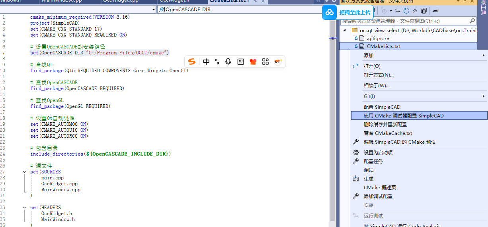
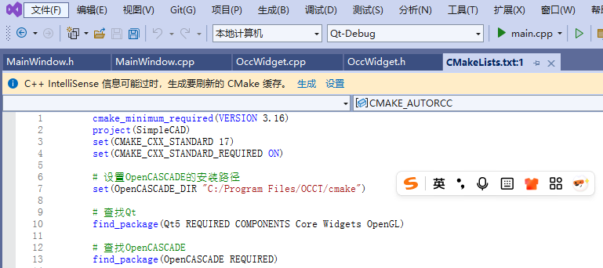
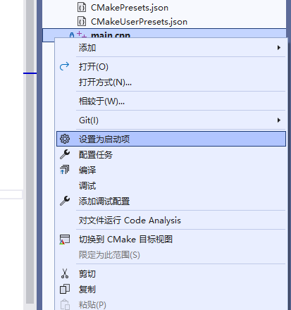

# ✅ 第6讲：独立 C++ OCCT 项目搭建与开发

> 本讲目标：从零搭建独立的 C++ OCCT 开发环境，重点掌握核心类的设计与实现，理解每个函数的具体作用，为构建完整的 CAD 应用打下基础。

---

## 🎯 1. 项目结构设计

### 📁 我们的项目长什么样？

```
OCCTraining/classCode/occqt_view_select/
├── CMakeLists.txt              # 告诉编译器怎么编译我们的项目
├── main.cpp                    # 程序的入口，就像大门
├── MainWindow.h/cpp            # 主窗口，管理整个界面
├── OccWidget.h/cpp             # 专门负责3D显示的组件
└── out/                        # 编译后的文件放这里，你要是cmake-gui来配置的话可能是build
```

### 🏗️ 三个核心角色分工

想象我们在搭建一个房子：

| 组件 | 比喻 | 具体职责 |
|------|------|----------|
| **main.cpp** | 🚪 **大门** | 启动整个程序，是整个房子的入口 |
| **MainWindow** | 🏠 **房子框架** | 管理窗口、按钮、菜单等界面元素 |
| **OccWidget** | 🎨 **画布房间** | 房子中的一个房间，专门负责显示和操作3D模型 |

---

## 🔧 2. CMake 配置 - 快速了解

我们用 CMake 来告诉电脑：我们的项目需要哪些库，怎么编译。

```cmake
# 最重要的几行配置
find_package(Qt5 REQUIRED COMPONENTS Core Widgets OpenGL)      # 找Qt库
find_package(OpenCASCADE REQUIRED)                             # 找OCCT库
target_link_libraries(${PROJECT_NAME} Qt5::Core Qt5::Widgets)  # 链接库
```
就像做菜前先准备食材一样，CMake 帮我们准备好所有需要的"编程食材"。然后有时候可能自动找不到石材的位置，这里可以直接给出位置的地址
```cmake
set(OpenCASCADE_DIR "C:/Program Files/OCCT/cmake")
```

---

## 🏛️ 3. 核心类设计与实现 - 重点内容

### 🎯 3.1 程序入口 - main.cpp

```cpp
#include <QApplication>
#include "MainWindow.h"

int main(int argc, char* argv[])
{
    QApplication app(argc, argv);    // 创建Qt应用
    
    MainWindow window;               // 创建主窗口
    window.show();                   // 显示窗口
    
    return app.exec();               // 开始事件循环，等待用户操作
}
```

**这段代码做了什么？**
- `QApplication app` - 创建一个Qt应用程序，就像启动一个程序框架
- `MainWindow window` - 创建我们的主窗口对象
- `window.show()` - 把窗口显示出来给用户看
- `app.exec()` - 开始"监听"用户的点击、键盘输入等操作

---

### 🏠 3.2 主窗口类 - MainWindow 详解

#### 📋 头文件 MainWindow.h - 定义窗口的"蓝图"

```cpp
#pragma once
#include <QMainWindow>
#include <QPushButton>
#include <QLabel>

class OccWidget;  // 先声明，后面会用到

class MainWindow : public QMainWindow
{
    Q_OBJECT  // 这行很重要！让Qt的信号槽能够工作

public:
    MainWindow(QWidget* parent = nullptr);  // 构造函数
    ~MainWindow();                          // 析构函数

private slots:  // 槽函数：响应按钮点击等事件
    void OnCreateBox();           // 当点击"创建立方体"按钮时调用
    void OnClearAll();            // 当点击"清除所有"按钮时调用
    void OnShapeSelected(int shapeId);  // 当选中3D对象时调用

private:
    // 窗口组件
    OccWidget* myOccWidget;           // 3D显示组件
    QPushButton* myCreateBoxButton;   // "创建立方体"按钮
    QPushButton* myClearButton;       // "清除所有"按钮
    QLabel* myStatusLabel;            // 状态标签

    void SetupUI();  // 设置界面布局的函数
};
```

#### 🤔 什么是信号和槽？

在讲具体实现前，先理解Qt的**信号槽机制**：

**比喻**：就像遥控器和电视机
- **信号(Signal)**：遥控器发出的"换台"信号
- **槽(Slot)**：电视机接收信号后执行的"换台"动作
- **连接(Connect)**：把遥控器和电视机配对

```cpp
// 实际代码例子
connect(myCreateBoxButton, &QPushButton::clicked,    // 信号：按钮被点击
        this, &MainWindow::OnCreateBox);             // 槽：执行创建立方体函数
```

意思是：当按钮被点击时，自动调用 `OnCreateBox()` 函数。

#### 🔧 实现文件 MainWindow.cpp - 核心函数详解

##### 函数1：SetupUI() - 搭建界面

```cpp
void MainWindow::SetupUI()
{
    // 第一步：创建中央区域
    QWidget* centralWidget = new QWidget(this);
    setCentralWidget(centralWidget);  // 设为主窗口的中心区域

    // 第二步：创建3D显示组件
    myOccWidget = new OccWidget(this);
    myOccWidget->setMinimumSize(800, 600);  // 设置最小尺寸

    // 第三步：创建按钮
    myCreateBoxButton = new QPushButton("创建立方体", this);
    myClearButton = new QPushButton("清除所有", this);

    // 第四步：创建状态显示标签
    myStatusLabel = new QLabel("准备就绪", this);

    // 第五步：安排布局（就像摆放家具）
    QVBoxLayout* mainLayout = new QVBoxLayout(centralWidget);      // 垂直布局
    QHBoxLayout* buttonLayout = new QHBoxLayout();                 // 水平布局

    // 按钮水平排列
    buttonLayout->addWidget(myCreateBoxButton);
    buttonLayout->addWidget(myClearButton);
    buttonLayout->addStretch();  // 添加弹簧，把按钮推到左边

    // 整体垂直排列：按钮在上，3D视图在下
    mainLayout->addLayout(buttonLayout);
    mainLayout->addWidget(myOccWidget, 1);  // 1表示占据剩余所有空间

    // 第六步：设置状态栏
    statusBar()->addWidget(myStatusLabel);

    // ⭐第七步：连接信号槽（重要！）
    connect(myCreateBoxButton, &QPushButton::clicked, 
            this, &MainWindow::OnCreateBox);
    connect(myClearButton, &QPushButton::clicked, 
            this, &MainWindow::OnClearAll);
    connect(myOccWidget, &OccWidget::ShapeSelected, 
            this, &MainWindow::OnShapeSelected);

    // 第八步：设置窗口属性
    setWindowTitle("简单的OCCT查看器");
    resize(1000, 800);

    // 第九步：初始化3D显示
    myOccWidget->InitializeOcc();
}
```

**这个函数在做什么？**
1. **搭架子**：创建窗口的基本框架
2. **放组件**：把按钮、3D视图等放到合适位置
3. **连电线**：用信号槽把按钮和功能函数连起来
4. **开机器**：初始化3D显示系统

##### 函数2：OnCreateBox() - 创建立方体

```cpp
void MainWindow::OnCreateBox()
{
    if (myOccWidget) {  // 确保3D组件存在
        // 计算位置（避免重叠）
        static int count = 0;           // 静态变量，记住创建了几个
        double offset = count * 60;     // 每个立方体间隔60单位

        // 调用3D组件的创建函数
        int shapeId = myOccWidget->AddBox(50, 50, 50, offset, 0, 0);

        // 检查是否创建成功
        if (shapeId >= 0) {
            myStatusLabel->setText(QString("创建立方体，ID: %1").arg(shapeId));
            count++;  // 成功了，计数器加1
        } else {
            myStatusLabel->setText("创建立方体失败");
        }
    }
}
```

**这个函数的逻辑**：
1. 检查3D组件是否正常
2. 计算新立方体的位置（不让它们重叠）
3. 调用3D组件创建立方体
4. 根据结果更新状态显示

##### 函数3：OnClearAll() - 清除所有对象

```cpp
void MainWindow::OnClearAll()
{
    if (myOccWidget) {
        myOccWidget->ClearAll();                    // 调用3D组件的清除函数
        myStatusLabel->setText("已清除所有对象");   // 更新状态显示
    }
}
```

##### 函数4：OnShapeSelected() - 响应对象选择

```cpp
void MainWindow::OnShapeSelected(int shapeId)
{
    myStatusLabel->setText(QString("选中立方体，ID: %1").arg(shapeId));
}
```

**这个函数的特点**：
- 它是一个**槽函数**，不是我们主动调用的
- 当用户在3D视图中点击选中对象时，OccWidget会发出信号
- 这个函数接收信号，更新状态显示

---

### 🎨 3.3 3D显示组件 - OccWidget 详解

这是我们项目中最复杂也最重要的部分！

#### 📋 头文件 OccWidget.h - 3D组件的"说明书"

```cpp
#pragma once
#include <QWidget>

// OpenCASCADE相关头文件
#include <AIS_InteractiveContext.hxx>  // 交互上下文
#include <V3d_Viewer.hxx>              // 3D查看器
#include <V3d_View.hxx>                // 3D视图
#include <AIS_Shape.hxx>               // 可显示的形状对象

class OccWidget : public QWidget
{
    Q_OBJECT

public:
    OccWidget(QWidget* parent = nullptr);
    ~OccWidget();

    void InitializeOcc();  // 初始化OCCT系统
    int AddBox(double width, double height, double depth, 
               double x = 0, double y = 0, double z = 0);  // 添加立方体
    void ClearAll();       // 清除所有对象

protected:
    // Qt事件处理函数（当用户操作鼠标时自动调用）
    void paintEvent(QPaintEvent* event) override;      // 重绘事件
    void resizeEvent(QResizeEvent* event) override;    // 窗口大小改变
    void mousePressEvent(QMouseEvent* event) override; // 鼠标按下
    void wheelEvent(QWheelEvent* event) override;      // 鼠标滚轮
    void mouseMoveEvent(QMouseEvent* event) override;  // 鼠标移动

signals:
    void ShapeSelected(int shapeId);  // 信号：当对象被选中时发出

private:
    // OCCT核心组件
    Handle(V3d_Viewer) myViewer;              // 3D查看器
    Handle(V3d_View) myView;                  // 3D视图
    Handle(AIS_InteractiveContext) myContext; // 交互上下文

    // 对象管理
    std::map<int, Handle(AIS_Shape)> myShapes;  // 存储所有3D对象
    int myNextShapeId;                          // 下一个对象的ID

    // 状态变量
    bool myViewInitialized;   // 是否已初始化
    QPoint myLastMousePos;    // 上次鼠标位置

    // 初始化相关函数
    void CreateViewer();      // 创建查看器
    void CreateView();        // 创建视图
};
```

#### 🔧 核心函数实现详解

##### 函数1：InitializeOcc() - 初始化3D系统

```cpp
void OccWidget::InitializeOcc()
{
    if (myViewInitialized) return;  // 已经初始化过了，直接返回

    try {
        CreateViewer();     // 第1步：创建3D查看器
        CreateView();       // 第2步：创建3D视图
        
        myViewInitialized = true;
        std::cout << "3D系统初始化成功!" << std::endl;

    } catch (const Standard_Failure& e) {
        std::cerr << "3D系统初始化失败: " << e.GetMessageString() << std::endl;
    }
}
```

**初始化做了什么？**
就像搭建一个3D舞台：
1. **搭舞台架子**（创建查看器）
2. **安装灯光和摄像机**（创建视图）

##### 函数2：CreateViewer() - 搭建3D舞台

```cpp
void OccWidget::CreateViewer()
{
    // 第1步：创建显示连接（连接到电脑的图形系统）
    Handle(Aspect_DisplayConnection) displayConnection = new Aspect_DisplayConnection();

    // 第2步：创建图形驱动（使用OpenGL来画3D图形）
    Handle(OpenGl_GraphicDriver) graphicDriver = new OpenGl_GraphicDriver(displayConnection);

    // 第3步：创建3D查看器（相当于3D舞台的总管理器）
    myViewer = new V3d_Viewer(graphicDriver);

    // 第4步：设置灯光
    myViewer->SetDefaultLights();  // 使用默认灯光
    myViewer->SetLightOn();        // 开灯

    // 第5步：创建交互上下文（管理3D对象的显示和选择）
    myContext = new AIS_InteractiveContext(myViewer);
}
```

**比喻理解**：
- **显示连接**：像连接投影仪的线
- **图形驱动**：像投影仪本身
- **查看器**：像整个放映厅
- **交互上下文**：像放映厅的管理员

##### 函数3：CreateView() - 安装摄像机

```cpp
void OccWidget::CreateView()
{
    // 第1步：创建窗口句柄（告诉OCCT在哪个窗口里显示）
    Handle(Aspect_Window) window;
#ifdef _WIN32
    window = new WNT_Window((Aspect_Handle)winId());  // Windows系统
#else
    window = new Xw_Window(myDisplayConnection, (Window)winId());  // Linux系统
#endif

    // 第2步：创建3D视图（相当于摄像机）
    myView = myViewer->CreateView();
    myView->SetWindow(window);  // 把摄像机对准我们的窗口

    // 第3步：如果窗口还没显示，先显示出来
    if (!window->IsMapped()) {
        window->Map();
    }

    // 第4步：设置背景和坐标轴
    myView->SetBackgroundColor(Quantity_NOC_GRAY30);  // 深灰色背景
    myView->TriedronDisplay(Aspect_TOTP_LEFT_LOWER,   // 左下角显示坐标轴
                           Quantity_NOC_GOLD, 0.08,   // 金色，大小0.08
                           V3d_ZBUFFER);

    // 第5步：设置投影模式（透视投影，像人眼看东西）
    myView->Camera()->SetProjectionType(Graphic3d_Camera::Projection_Perspective);
}
```

##### 函数4：AddBox() - 创建并显示立方体

```cpp
int OccWidget::AddBox(double width, double height, double depth, double x, double y, double z)
{
    try {
        // 第1步：用OCCT创建立方体几何
        BRepPrimAPI_MakeBox boxMaker(width, height, depth);
        TopoDS_Shape box = boxMaker.Shape();

        // 第2步：如果需要移动位置
        if (x != 0 || y != 0 || z != 0) {
            gp_Trsf transform;                          // 创建变换对象
            transform.SetTranslation(gp_Vec(x, y, z));  // 设置平移
            BRepBuilderAPI_Transform transformer(box, transform);
            box = transformer.Shape();                  // 应用变换
        }

        // 第3步：包装成可显示对象
        Handle(AIS_Shape) aisShape = new AIS_Shape(box);

        // 第4步：设置外观
        Quantity_Color color(0.7, 0.5, 0.3, Quantity_TOC_RGB);  // 棕色
        aisShape->SetColor(color);                               // 设置颜色
        aisShape->SetDisplayMode(AIS_Shaded);                    // 实体显示模式

        // 第5步：添加到3D场景中
        myContext->Display(aisShape, Standard_True);  // 显示对象

        // 第6步：管理对象
        int shapeId = myNextShapeId++;         // 分配一个唯一ID
        myShapes[shapeId] = aisShape;          // 保存到映射表中

        // 第7步：调整视图（让所有对象都能看到）
        myView->FitAll();

        std::cout << "创建立方体成功，ID: " << shapeId << std::endl;
        return shapeId;  // 返回ID给调用者

    } catch (const Standard_Failure& e) {
        std::cerr << "创建立方体失败: " << e.GetMessageString() << std::endl;
        return -1;  // 失败返回-1
    }
}
```

**这个函数的7个步骤**：
1. **造形状**：用OCCT的工具造一个立方体
2. **搬位置**：如果需要，把它移到指定位置
3. **穿衣服**：包装成可以显示的对象
4. **化妆**：设置颜色和显示效果
5. **上舞台**：放到3D场景中显示
6. **做记录**：给它分配ID号，记录在册
7. **调镜头**：调整摄像机，确保能看到所有东西

##### 函数5：鼠标事件处理

###### mousePressEvent() - 鼠标按下

```cpp
void OccWidget::mousePressEvent(QMouseEvent* event)
{
    if (myContext.IsNull()) return;  // 确保3D系统正常

    myLastMousePos = event->pos();   // 记录鼠标位置

    if (event->button() == Qt::LeftButton) {  // 如果是左键点击
        // 第1步：告诉OCCT鼠标位置
        myContext->MoveTo(event->x(), event->y(), myView, Standard_True);
        
        // 第2步：执行选择
        myContext->Select(Standard_True);

        // 第3步：检查是否选中了什么
        if (myContext->NbSelected() > 0) {  // 有选中的对象
            // 遍历所有选中的对象
            for (myContext->InitSelected(); myContext->MoreSelected(); myContext->NextSelected()) {
                Handle(AIS_InteractiveObject) selectedObj = myContext->SelectedInteractive();

                // 在我们的对象映射表中找到对应的ID
                for (const auto& pair : myShapes) {
                    if (pair.second == selectedObj) {
                        std::cout << "选中了对象，ID: " << pair.first << std::endl;
                        emit ShapeSelected(pair.first);  // 发出信号！
                        break;
                    }
                }
            }
        } else {
            std::cout << "没有选中任何对象" << std::endl;
        }
    }
}
```

###### wheelEvent() - 滚轮缩放

```cpp
void OccWidget::wheelEvent(QWheelEvent* event)
{
    if (myView.IsNull()) return;

    const double zoomFactor = 1.1;  // 缩放系数

    if (event->angleDelta().y() > 0) {        // 向上滚
        myView->SetZoom(zoomFactor);          // 放大
    } else {                                  // 向下滚
        myView->SetZoom(1.0 / zoomFactor);    // 缩小
    }
}
```

###### mouseMoveEvent() - 鼠标拖拽

```cpp
void OccWidget::mouseMoveEvent(QMouseEvent* event)
{
    if (myView.IsNull()) return;

    if (event->buttons() & Qt::MiddleButton) {        // 中键拖拽 = 平移
        QPoint delta = event->pos() - myLastMousePos;
        myView->Pan(delta.x(), -delta.y());

    } else if (event->buttons() & Qt::RightButton) {  // 右键拖拽 = 旋转
        QPoint delta = event->pos() - myLastMousePos;
        myView->Turn(delta.x() * 0.01, delta.y() * 0.01);
    }

    myLastMousePos = event->pos();  // 更新鼠标位置
}
```

**交互总结**：
- **左键点击**：选择对象
- **滚轮**：缩放视图
- **中键拖拽**：平移视图
- **右键拖拽**：旋转视图

---

## 🔨 4. 编译和测试（vs版）

### 📋 编译步骤
这里右键CMakeLists.txt 选择使用CMake调试器配置



然后vs的顶部会提示IntelliSense信息过时，这里点击生成



然后项目就配置好了，接下来选择main.cpp作为启动项就可以进行调试运行了。




## 🧪 课后作业

### 📝 基础练习
1. **运行项目**：成功编译和运行示例代码
2. **修改颜色**：将立方体颜色改为红色
3. **添加球体**：参考AddBox函数，实现AddSphere函数

### 🚀 进阶练习
4. **多选功能**：实现Ctrl+点击的多选功能
